# Typesetting Engine - SE CSS 完整支持设计方案

## 1. 设计原则

**对现有架构友好**：所有改动基于现有模块扩展，不重写核心数据结构，保持 `Engine → LayoutEngine → Page/Line/TextRun` 管线不变。

| 原则 | 说明 |
|------|------|
| 渐进扩展 | 新增模块（css、style_resolver），现有模块做最小修改 |
| 接口兼容 | 现有 `layoutHTML(html, chapterId, style, pageSize)` 保留，新增带 CSS 参数的重载 |
| 职责不变 | `PlatformAdapter` 不变，`Engine` 仍是门面，`LayoutEngine` 仍做排版 |
| 数据流不变 | HTML → Block[] → Line[] → Page[] 管线保持 |
| 绑定层最小改动 | Swift/JNI 只新增 CSS 字符串参数，其余接口不变 |

---

## 2. 现有架构

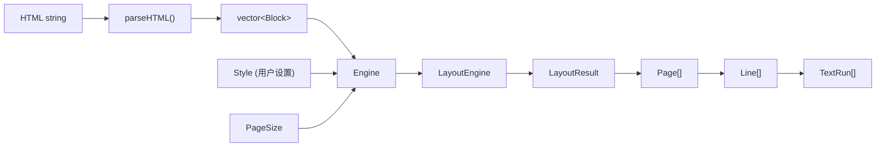

### 现有模块清单

| 文件 | 职责 | 改动程度 |
|------|------|----------|
| `platform.h` | 字体度量 / 文本测量 / 断行 | **不变** |
| `document.h` / `document.cpp` | HTML 解析 → Block/InlineElement | **小改** - 新增属性字段 |
| `style.h` / `style.cpp` | 用户全局样式 Style | **小改** - 新增 BlockComputedStyle |
| `page.h` / `page.cpp` | TextRun/Line/Page 输出数据 | **小改** - TextRun 新增渲染属性 |
| `layout.h` / `layout.cpp` | 排版引擎 | **中改** - 支持 per-block 样式、多字体 inline |
| `engine.h` / `engine.cpp` | 门面 | **小改** - 新增带 CSS 的重载 |
| `linebreaker.cpp` | 断行算法（当前未使用） | **不变**（保留备用） |
| `TypesettingBridge.h/mm` | iOS 绑定 | **小改** - 新增 CSS 参数 |
| `TypesettingJNI.h/cpp` | Android 绑定 | **中改** - 补全实现 + CSS 参数 |

---

## 3. 目标架构

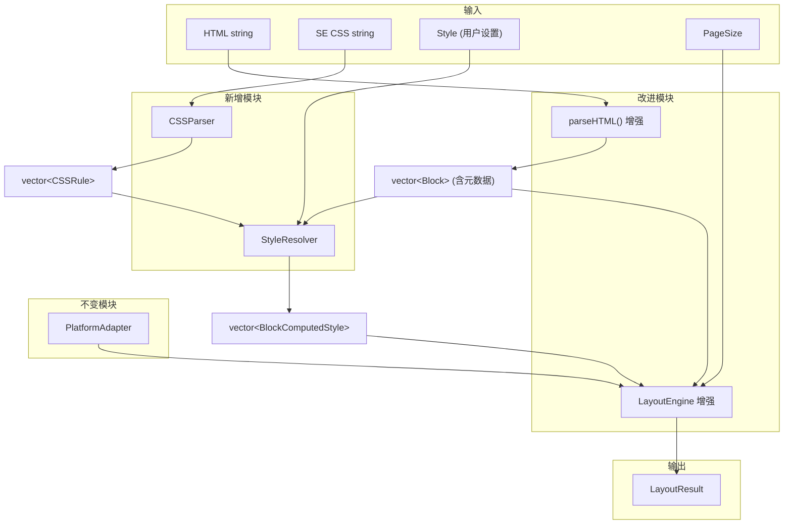

---

## 4. 新增模块设计

### 4.1 CSS 解析器（`css.h` / `css.cpp`）

**职责**：将 SE CSS 字符串解析为结构化规则列表。

#### 数据模型

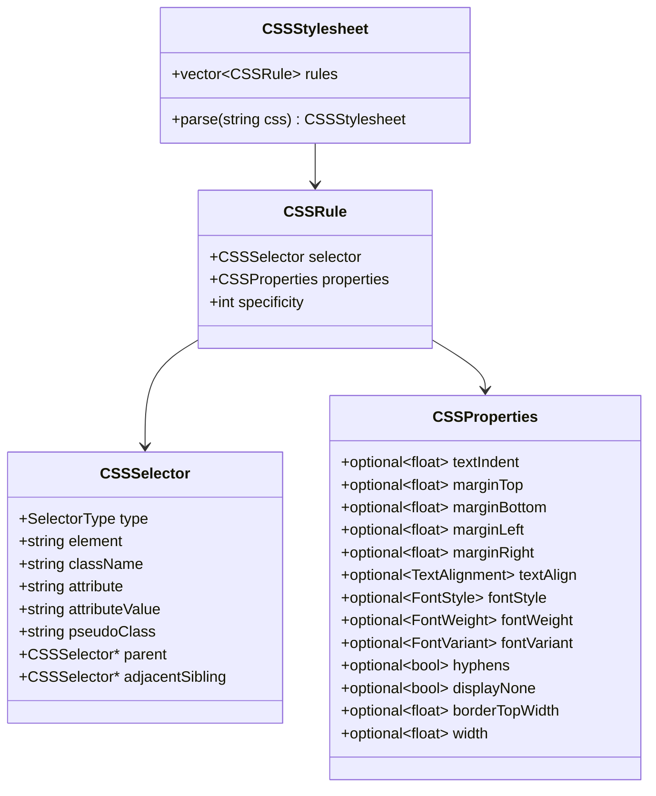

#### 需要支持的选择器

| 优先级 | 选择器类型 | 示例 | SE CSS 用例 |
|--------|-----------|------|------------|
| P0 | 元素 | `p`, `h2`, `blockquote` | 所有基础排版 |
| P0 | Class | `.epub-type-contains-word-z3998-song` | 歌曲/诗歌/献辞 |
| P0 | 后代 | `blockquote p` | 引用块内段落 |
| P0 | 相邻兄弟 | `h2 + p`, `hr + p` | 首段不缩进 |
| P0 | 伪类 | `p:first-child` | 首段不缩进 |
| P1 | 属性 | `[epub\|type~="dedication"]` | 献辞/版权页 |
| P1 | 组合 | `hgroup h2 + p` | 多级选择 |
| P2 | `@media` | `prefers-color-scheme` | 暗色模式（可忽略，由用户 Style 控制） |
| P2 | `@supports` | `(hanging-punctuation)` | 特性检测（可忽略） |

#### 需要支持的属性

| 优先级 | CSS 属性 | 映射目标 | 说明 |
|--------|---------|---------|------|
| P0 | `text-indent` | `BlockComputedStyle.textIndent` | 段落首行缩进（SE: `1em`） |
| P0 | `margin` | `BlockComputedStyle.margin*` | 块级元素外间距 |
| P0 | `text-align` | `BlockComputedStyle.alignment` | 对齐方式 |
| P0 | `font-style` | `BlockComputedStyle.fontStyle` | 斜体 |
| P0 | `font-weight` | `BlockComputedStyle.fontWeight` | 字重 |
| P0 | `font-variant: small-caps` | `BlockComputedStyle.smallCaps` | SE 用小型大写代替粗体 |
| P0 | `hyphens` | `BlockComputedStyle.hyphens` | 断词控制 |
| P0 | `display: none` | `BlockComputedStyle.hidden` | 隐藏元素 |
| P1 | `font-variant-numeric` | `BlockComputedStyle.oldstyleNums` | 老式数字 |
| P1 | `hanging-punctuation` | `BlockComputedStyle.hangingPunctuation` | 悬挂标点 |
| P1 | `border-top` | `BlockComputedStyle.borderTop` | HR 样式 |
| P1 | `width` (%) | `BlockComputedStyle.widthPercent` | HR 宽度 |

---

### 4.2 样式解析器（`style_resolver.h` / `style_resolver.cpp`）

**职责**：将 CSS 规则 + 用户 Style + Block 元数据 → 每个 Block 的计算样式。

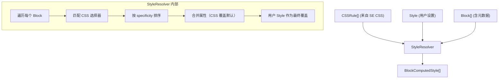

#### 样式优先级（从低到高）

| 层级 | 来源 | 说明 |
|------|------|------|
| 1 | 引擎默认值 | BlockType → 默认样式映射 |
| 2 | SE CSS 规则 | 按 specificity 排序，低到高应用 |
| 3 | 用户 Style | 用户设置的字体/字号/间距覆盖 SE CSS |

#### 用户 Style 覆盖规则

| 用户 Style 属性 | 覆盖行为 |
|----------------|---------|
| `font.family` | 替换所有 Block 的字体族 |
| `font.size` | 作为基准，CSS 中的 `em` 相对于此值计算 |
| `font.weight` | 作为正文基准，标题等保持相对关系 |
| `lineSpacingMultiplier` | 覆盖所有 Block |
| `letterSpacing` | 覆盖所有 Block |
| `wordSpacing` | 覆盖所有 Block |
| `paragraphSpacing` | 覆盖所有 Block |
| `alignment` | 覆盖所有 Block（除 CSS 标记为 `text-align: center` 的标题） |
| `hyphenation` | 覆盖所有 Block（除 CSS 标记为 `hyphens: none` 的标题） |
| `textIndent` | **不覆盖** — 由 CSS 控制（SE CSS 用 `1em`，用户不设此项） |
| `margin*` | 作为页面边距，不影响 Block 级别的 CSS margin |

---

### 4.3 BlockComputedStyle（新增数据结构）

**位置**：`style.h` 中新增

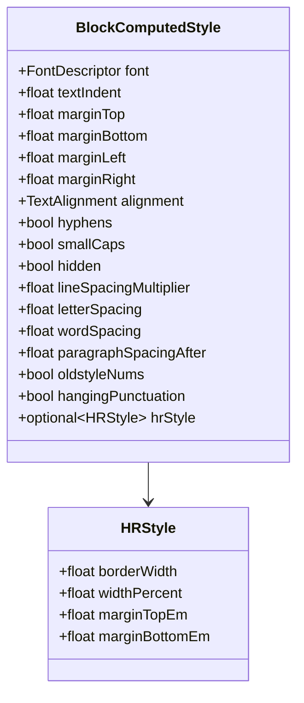

---

## 5. 现有模块改动

### 5.1 document.h — Block 新增元数据

**目的**：支持 CSS 选择器匹配

| 新增字段 | 类型 | 用途 |
|---------|------|------|
| `className` | `string` | HTML class 属性值（如 `"epub-type-contains-word-z3998-song"`） |
| `epubType` | `string` | `epub:type` 属性值（如 `"chapter"`） |
| `htmlTag` | `string` | 原始 HTML 标签名（如 `"section"`, `"p"`, `"blockquote"`） |
| `parentTag` | `string` | 父元素标签名（用于后代选择器） |
| `parentClassName` | `string` | 父元素 class（用于后代选择器） |
| `isFirstChild` | `bool` | 是否为父元素的第一个子 Block（`:first-child`） |
| `previousSiblingTag` | `string` | 前一个兄弟元素标签名（`h2 + p`） |

**InlineElement 新增字段**：

| 新增字段 | 类型 | 用途 |
|---------|------|------|
| `lang` | `string` | `<i lang="lt">` 语言标记 |
| `className` | `string` | inline 元素的 class |
| `epubType` | `string` | `<abbr epub:type="z3998:name-title">` |

### 5.2 document.cpp — parseHTML 增强

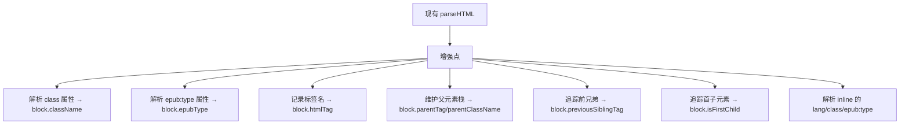

**改动范围**：
- `parseTag()` 函数：在提取 tag.name 后，额外提取 `class`、`epub:type`、`lang` 属性
- 主循环：维护一个父元素栈（`vector<ParentInfo>`），在遇到块级开标签时入栈，闭标签时出栈
- Block 创建时：从栈顶读取 parent 信息，从上一个 Block 读取 previousSibling 信息

### 5.3 page.h — TextRun 新增渲染属性

| 新增字段 | 类型 | 用途 |
|---------|------|------|
| `smallCaps` | `bool` | 是否用小型大写渲染 |
| `isLink` | `bool` | 是否为链接 |
| `href` | `string` | 链接目标 |

### 5.4 page.h — Page 新增装饰元素

| 新增字段 | 类型 | 用途 |
|---------|------|------|
| `decorations` | `vector<Decoration>` | HR 线条等装饰元素 |

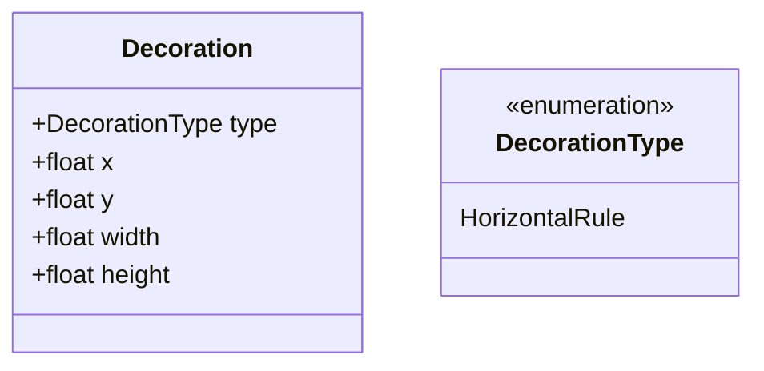

### 5.5 layout.cpp — 核心排版改进

#### 5.5.1 多字体 Inline 排版

**现状问题**：`layoutBlockLines()` 将所有 inline 文本拼接为 `fullText`，用单一 `blockFont` 测量，丢失了 Bold/Italic/Code 字体差异。

**改进方案**：

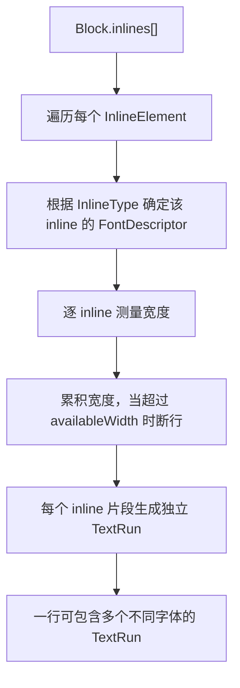

| 改动点 | 说明 |
|--------|------|
| `layoutBlockLines()` | 重写为按 inline 逐段排版，而非拼接全文 |
| TextRun 生成 | 每个 inline 片段一个 TextRun（保留 inlineIndex 追踪） |
| 断行 | 在 inline 边界处优先断行；inline 内部使用 `platform_->findLineBreak()` |
| 基线对齐 | 同一行内不同字体的 TextRun 按最大 ascent 对齐基线 |

#### 5.5.2 BlockComputedStyle 驱动排版

**现状**：`layoutChapter()` 中的 `switch(block.type)` 硬编码样式。

**改进**：

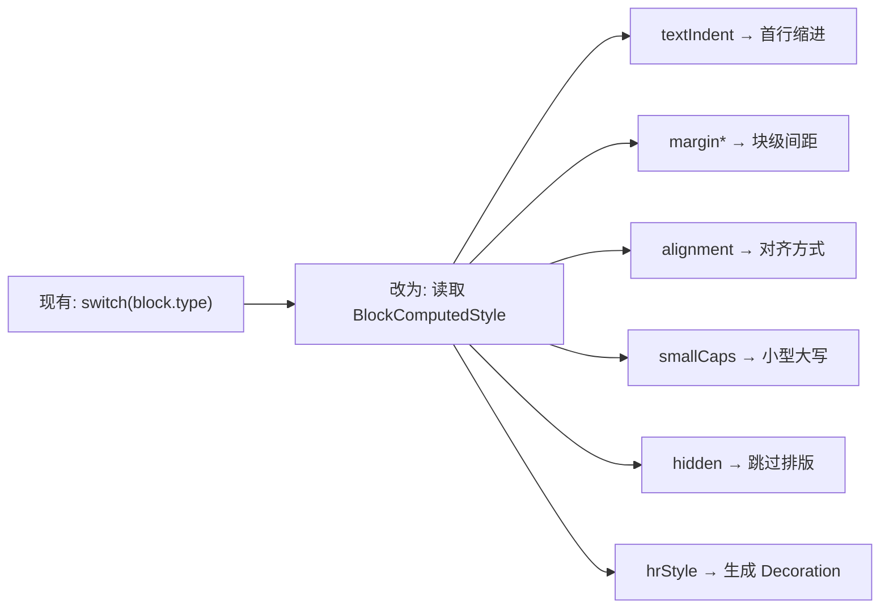

`LayoutEngine::layoutChapter()` 新增参数：`const vector<BlockComputedStyle>& styles`

#### 5.5.3 justifyLine 修复

**现状**：额外空间全部加到第一个 run 的 width 上。

**改进**：

| 步骤 | 说明 |
|------|------|
| 1 | 统计行内所有 TextRun 中的空格总数 |
| 2 | 计算 `extraPerSpace = extraSpace / spaceCount` |
| 3 | 在每个空格位置处将 TextRun 拆分，插入额外间距 |
| 4 | 依次重新计算每个 TextRun 的 x 坐标 |

#### 5.5.4 text-indent 实现

| 场景 | 行为 |
|------|------|
| 段落首行 | `availableWidth -= textIndent`，首个 TextRun 的 x 偏移 `textIndent` |
| 非首行 | 正常排版 |
| `h2 + p` 首段 | CSS 设 `textIndent: 0`，StyleResolver 已计算好 |

### 5.6 engine.h — 新增带 CSS 的接口

| 方法 | 说明 |
|------|------|
| `layoutHTML(html, css, chapterId, style, pageSize)` | 新增重载，接受 CSS 字符串 |
| `setStylesheet(css)` | 缓存解析后的 CSS，`relayout()` 时复用 |

现有 `layoutHTML(html, chapterId, style, pageSize)` 保留，行为不变（无 CSS 时使用引擎默认样式）。

---

## 6. 绑定层改动

### 6.1 iOS（TypesettingBridge）

| 改动 | 说明 |
|------|------|
| `TSStyle` 新增 | `cssString` 属性（`NSString*`） |
| `layoutHTML:` 方法 | 新增 `css:` 参数 |
| `convertStyle:` | 传递 cssString 给 Engine |

### 6.2 Android（TypesettingJNI）

| 改动 | 说明 |
|------|------|
| `nativeCreate` | 新增 `jobject measureHelper` 参数，连接 AndroidPlatformAdapter |
| `nativeLayoutHTML` | 新增 `jstring css` 参数，实现完整的 style 提取和结果转换 |
| `nativeRelayout` | 实现完整的 style 提取和结果转换 |
| Kotlin 端 | `TypesettingEngine.kt` 暴露 `layoutHTML(html, css, ...)` |

---

## 7. 数据流全景

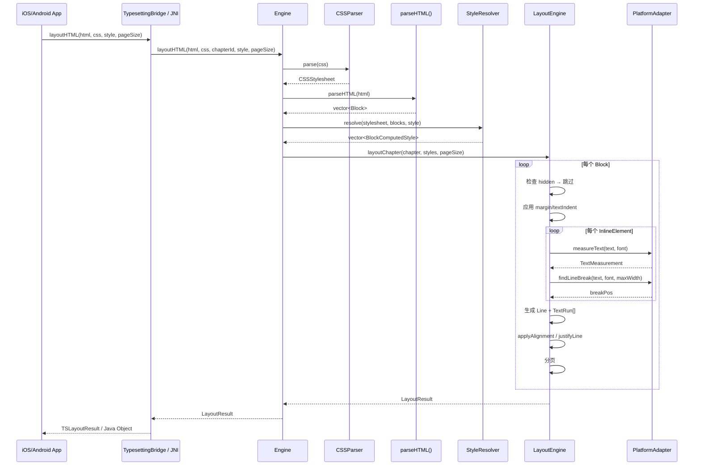

---

## 8. 文件清单

### 新增文件

| 文件 | 模块 | 职责 |
|------|------|------|
| `include/typesetting/css.h` | CSS 解析 | CSSSelector, CSSProperties, CSSRule, CSSStylesheet |
| `src/css.cpp` | CSS 解析 | CSS 字符串 → CSSStylesheet 实现 |
| `include/typesetting/style_resolver.h` | 样式计算 | StyleResolver 类声明 |
| `src/style_resolver.cpp` | 样式计算 | CSS 匹配 + 合并 + 用户覆盖 |
| `tests/test_css.cpp` | 测试 | CSS 解析测试 |
| `tests/test_style_resolver.cpp` | 测试 | 样式计算测试 |

### 修改文件

| 文件 | 改动量 | 主要改动 |
|------|--------|---------|
| `include/typesetting/document.h` | 小 | Block/InlineElement 新增元数据字段 |
| `src/document.cpp` | 中 | parseHTML 提取 class/epubType/parent/sibling |
| `include/typesetting/style.h` | 小 | 新增 BlockComputedStyle 结构体 |
| `include/typesetting/page.h` | 小 | TextRun 新增 smallCaps/isLink；Page 新增 decorations |
| `include/typesetting/layout.h` | 小 | layoutChapter 参数新增 styles |
| `src/layout.cpp` | 大 | 多字体 inline 排版 + BlockComputedStyle 驱动 + justifyLine 修复 |
| `include/typesetting/engine.h` | 小 | 新增带 CSS 的 layoutHTML 重载 |
| `src/engine.cpp` | 小 | 调用 CSSParser + StyleResolver |
| `bindings/swift/TypesettingBridge.h` | 小 | TSStyle 新增 cssString |
| `bindings/swift/TypesettingBridge.mm` | 小 | 传递 CSS 给 Engine |
| `bindings/jni/TypesettingJNI.h` | 小 | 函数签名调整 |
| `bindings/jni/TypesettingJNI.cpp` | 大 | 补全 JNI 实现 |
| `tests/CMakeLists.txt` | 小 | 新增测试文件 |

---

## 9. 实施阶段

```mermaid
gantt
    title 实施阶段
    dateFormat X
    axisFormat %s

    section Phase 1: HTML 增强
    parseHTML 提取元数据           :p1a, 0, 2
    Block/InlineElement 新增字段  :p1b, 0, 1
    单元测试                      :p1c, 2, 3

    section Phase 2: CSS 解析
    CSSSelector/CSSProperties 结构 :p2a, 3, 4
    CSS 字符串解析器               :p2b, 4, 7
    单元测试                       :p2c, 7, 8

    section Phase 3: 样式计算
    StyleResolver 实现             :p3a, 8, 10
    BlockComputedStyle 结构        :p3b, 8, 9
    用户 Style 覆盖逻辑            :p3c, 10, 11
    单元测试                       :p3d, 11, 12

    section Phase 4: 排版引擎
    多字体 inline 排版              :p4a, 12, 15
    BlockComputedStyle 驱动排版     :p4b, 12, 15
    justifyLine 修复                :p4c, 15, 16
    text-indent 实现                :p4d, 15, 16
    Decoration 渲染数据             :p4e, 16, 17
    单元测试                        :p4f, 17, 18

    section Phase 5: 绑定层
    iOS TypesettingBridge 更新      :p5a, 18, 19
    Android JNI 补全                :p5b, 18, 20
    集成测试                        :p5c, 20, 21
```

### Phase 1: HTML 解析增强

| 任务 | 改动文件 | 说明 |
|------|---------|------|
| Block 新增字段 | `document.h` | className, epubType, htmlTag, parentTag, parentClassName, isFirstChild, previousSiblingTag |
| InlineElement 新增字段 | `document.h` | lang, className, epubType |
| parseHTML 增强 | `document.cpp` | 提取属性，维护父元素栈，追踪兄弟关系 |
| 测试 | `test_layout.cpp` | 验证 SE HTML 解析后的元数据正确性 |

### Phase 2: CSS 解析器

| 任务 | 改动文件 | 说明 |
|------|---------|------|
| 数据结构 | `css.h` | CSSSelector, CSSProperties, CSSRule, CSSStylesheet |
| 解析器 | `css.cpp` | 标记化 → 规则提取 → 选择器解析 → 属性解析 |
| 单位换算 | `css.cpp` | `em` → px（基于用户 font.size），`%` → 比例值 |
| 测试 | `test_css.cpp` | 用实际 SE CSS 片段验证 |

### Phase 3: 样式计算

| 任务 | 改动文件 | 说明 |
|------|---------|------|
| BlockComputedStyle | `style.h` | 新增结构体 |
| StyleResolver | `style_resolver.h/cpp` | 选择器匹配 + 属性合并 + 用户覆盖 |
| 引擎默认值 | `style_resolver.cpp` | BlockType → 默认样式映射（替代 layout.cpp 中的 switch） |
| 测试 | `test_style_resolver.cpp` | 验证优先级、覆盖规则 |

### Phase 4: 排版引擎增强

| 任务 | 改动文件 | 说明 |
|------|---------|------|
| 多字体 inline | `layout.cpp` | 按 InlineElement 逐段排版，每段独立 TextRun |
| 样式驱动 | `layout.cpp` | 移除 switch(block.type)，读取 BlockComputedStyle |
| justifyLine | `layout.cpp` | 按空格分布额外空间 |
| text-indent | `layout.cpp` | 首行缩进 |
| small-caps | `layout.cpp` + `page.h` | TextRun.smallCaps 标记，平台层负责大写转换 |
| hidden | `layout.cpp` | display:none 的 Block 跳过排版 |
| Decoration | `layout.cpp` + `page.h` | HR 生成 Decoration 数据 |

### Phase 5: 绑定层 + 集成

| 任务 | 改动文件 | 说明 |
|------|---------|------|
| iOS 绑定 | `TypesettingBridge.h/mm` | 新增 CSS 参数 |
| Android JNI | `TypesettingJNI.h/cpp` | 补全全部 JNI 实现 |
| Engine 门面 | `engine.h/cpp` | 新增重载，串联 CSS 解析 → 样式计算 → 排版 |
| 集成测试 | `test_layout.cpp` | 用实际 SE HTML + CSS 端到端验证 |

---

## 10. SE CSS 特殊处理

基于实际分析的 SE CSS（《丛林》），以下是需要特殊关注的规则：

| SE CSS 规则 | 引擎处理方式 |
|------------|-------------|
| `b, strong { font-variant: small-caps; font-weight: normal; }` | StyleResolver 将 Bold InlineType 映射为 smallCaps=true, weight=Regular |
| `h1-h6 { font-variant: small-caps; text-align: center; }` | StyleResolver 为标题 Block 设置 smallCaps + Center |
| `p { text-indent: 1em; }` | 默认段落缩进 = 1 * userFontSize |
| `h2 + p { text-indent: 0; }` | StyleResolver 通过 previousSiblingTag=="h2" 匹配，覆盖 textIndent=0 |
| `hr + p { text-indent: 0; }` | 同上，previousSiblingTag=="hr" |
| `p:first-child { text-indent: 0; }` | StyleResolver 通过 isFirstChild 匹配 |
| `.epub-type-contains-word-z3998-song p { font-style: italic; text-indent: 0; }` | 后代选择器匹配 parentClassName |
| `section[epub\|type~="dedication"] p { font-variant: small-caps; text-align: center; }` | 属性选择器匹配 parentEpubType |
| `blockquote { margin: 1em 2.5em; }` | 转换为 px margin |
| `hr { border-top: 1px solid; width: 25%; }` | 生成 Decoration，居中绘制 |
| `display: none` | BlockComputedStyle.hidden = true，跳过排版 |
| 标题 `hyphens: none` | BlockComputedStyle.hyphens = false |

---

## 11. PlatformAdapter 不变性说明

| 方面 | 说明 |
|------|------|
| 接口 | `resolveFontMetrics`, `measureText`, `findLineBreak`, `supportsHyphenation`, `findHyphenationPoints` — 全部不变 |
| small-caps | 由引擎层处理：将文本转为大写 + 用更小字号测量/渲染，或者由 TextRun.smallCaps 标记，由平台渲染层处理 |
| 字体变体 | FontDescriptor 已有 family/size/weight/style，足以覆盖所有 CSS 字体需求 |
| 新增能力 | **不需要** — 现有 PlatformAdapter 接口完全满足需求 |

---

## 12. 向后兼容性

| 场景 | 行为 |
|------|------|
| 无 CSS 调用 | `layoutHTML(html, chapterId, style, pageSize)` 现有签名保留，使用引擎默认样式（等同现有行为） |
| Block 新增字段 | 全部有默认值，现有测试无需修改 |
| TextRun 新增字段 | 全部有默认值（`smallCaps=false`, `isLink=false`），现有渲染代码忽略新字段即可 |
| 新增 Page.decorations | 默认为空，现有渲染代码不受影响 |
