# Typesetting Engine — 设计文档

## 目录

1. [项目概述](#1-项目概述)
2. [设计原则](#2-设计原则)
3. [系统架构](#3-系统架构)
4. [核心数据模型](#4-核心数据模型)
5. [模块详细设计](#5-模块详细设计)
   - 5.1 [平台抽象层 (PlatformAdapter)](#51-平台抽象层-platformadapter)
   - 5.2 [HTML 解析器 (Document)](#52-html-解析器-document)
   - 5.3 [CSS 解析器 (CSSStylesheet)](#53-css-解析器-cssstylesheet)
   - 5.4 [样式解析器 (StyleResolver)](#54-样式解析器-styleresolver)
   - 5.5 [排版引擎 (LayoutEngine)](#55-排版引擎-layoutengine)
   - 5.6 [引擎门面 (Engine)](#56-引擎门面-engine)
6. [平台绑定层](#6-平台绑定层)
   - 6.1 [iOS 绑定 (TypesettingBridge)](#61-ios-绑定-typesettingbridge)
   - 6.2 [Android 绑定 (TypesettingJNI)](#62-android-绑定-typesettingjni)
7. [数据流](#7-数据流)
8. [关键算法](#8-关键算法)
9. [样式层叠与优先级](#9-样式层叠与优先级)
10. [SE CSS 支持](#10-se-css-支持)
11. [构建与测试](#11-构建与测试)
12. [文件清单](#12-文件清单)
13. [向后兼容性](#13-向后兼容性)
14. [交互层 (Interaction Module)](#14-交互层-interaction-module)
15. [交互层数据模型](#15-交互层数据模型)
16. [交互层 API](#16-交互层-api)
17. [交互算法](#17-交互算法)
   - 17.1 [命中测试 (hitTest)](#171-命中测试-hittest)
   - 17.2 [分词 (wordAtPoint)](#172-分词-wordatpoint)
   - 17.3 [句子分割 (getSentences)](#173-句子分割-getsentences)
   - 17.4 [范围→矩形 (getRectsForRange)](#174-范围矩形-getrectsforrange)
   - 17.5 [段落矩形 (getBlockRect)](#175-段落矩形-getblockrect)
   - 17.6 [图片命中测试 (hitTestImage)](#176-图片命中测试-hittestimage)
18. [封面页](#18-封面页)
19. [页面元信息 (PageInfo)](#19-页面元信息-pageinfo)
20. [Engine 缓存变更](#20-engine-缓存变更)
21. [平台绑定层变更](#21-平台绑定层变更)
22. [文件清单（交互层）](#22-文件清单)
23. [实施依赖与阶段](#23-实施依赖与阶段)
24. [向后兼容性（交互层）](#24-向后兼容性交互层)
25. [不在引擎范围的特性](#25-不在引擎范围的特性)
26. [外部接口详细规格](#26-外部接口详细规格)
   - 26.1 [C++ 核心接口 (Engine)](#261-c-核心接口-engine)
   - 26.2 [iOS 绑定接口 (TypesettingBridge)](#262-ios-绑定接口-typesettingbridge)
   - 26.3 [Android 绑定接口 (TypesettingJNI)](#263-android-绑定接口-typesettingjni)
   - 26.4 [错误处理约定](#264-错误处理约定)
   - 26.5 [线程安全约定](#265-线程安全约定)

---

## 1. 项目概述

Typesetting Engine 是一个高性能的 C++17 排版引擎，专为电子书阅读场景设计，服务于 iOS 和 Android 平台。引擎接收 HTML 内容和 CSS 样式，结合用户阅读偏好，输出精确定位的排版结果（页面、行、文本片段），由平台原生渲染层负责最终绘制。

### 核心能力

| 能力 | 说明 |
|------|------|
| HTML 解析 | 解析 Standard Ebooks 格式的 HTML，提取块级元素和行内元素 |
| CSS 样式 | 完整支持 SE CSS 选择器匹配和属性解析 |
| 样式层叠 | 三层优先级：引擎默认值 → CSS 规则 → 用户偏好 |
| 多字体行内排版 | 同一行内支持不同字体的 TextRun（粗体、斜体、等宽等） |
| 文本排版 | 两端对齐、断词、首行缩进、小型大写 |
| 跨平台 | 平台无关的 C++ 核心 + 原生绑定（CoreText / JNI） |

### 技术栈

| 组件 | 技术 |
|------|------|
| 核心引擎 | C++17, CMake 3.20+ |
| 测试框架 | GoogleTest v1.14.0 |
| iOS 绑定 | Objective-C++, CoreText / CoreFoundation / CoreGraphics |
| Android 绑定 | C++/JNI, Skia / HarfBuzz |
| 编译器要求 | Clang 10+ / GCC 9+ / MSVC 19.14+ |

---

## 2. 设计原则

| 原则 | 说明 |
|------|------|
| 管线架构 | 数据沿 HTML → Block[] → BlockComputedStyle[] → Line[] → Page[] 管线单向流动 |
| 平台无关核心 | 所有排版逻辑在 C++ 层完成，通过 `PlatformAdapter` 抽象接口获取字体度量 |
| 关注点分离 | 解析、样式计算、排版、输出各自独立，单一职责 |
| 渐进扩展 | 新增模块（css、style_resolver）基于现有架构扩展，不重写核心数据结构 |
| 接口兼容 | 保留无 CSS 的旧接口，新增带 CSS 参数的重载 |
| 数据驱动排版 | 排版引擎由 `BlockComputedStyle` 驱动，不硬编码块类型与样式的映射 |
| 最小平台依赖 | 核心引擎仅使用 C++ 标准库（`vector`, `string`, `optional`, `shared_ptr`），无第三方依赖 |

---

## 3. 系统架构

### 3.1 整体架构

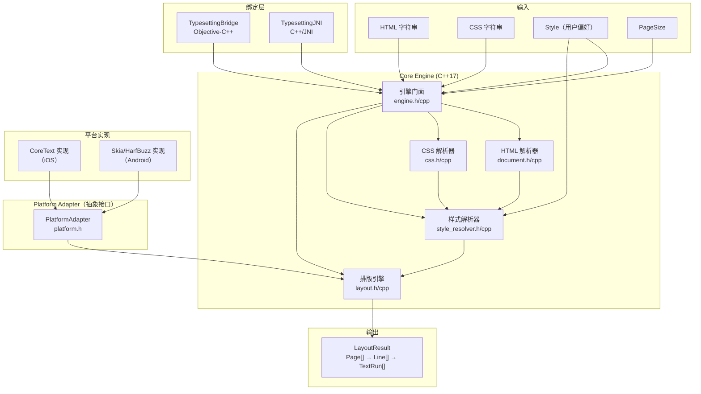

### 3.2 设计模式

| 模式 | 应用位置 | 说明 |
|------|---------|------|
| **门面模式 (Facade)** | `Engine` | 统一入口，协调 HTML 解析、CSS 解析、样式计算、排版 |
| **Pimpl 模式** | `LayoutEngine` | 隐藏排版实现细节，减少头文件依赖，保持 ABI 稳定 |
| **抽象工厂 (Abstract Interface)** | `PlatformAdapter` | 定义字体度量和文本测量的平台无关接口 |
| **工厂方法 (Factory)** | `InlineElement` | 静态工厂方法创建不同类型的行内元素 |
| **策略模式 (Strategy)** | `StyleResolver` | 可替换的样式解析策略（默认值 → CSS → 用户覆盖） |

---

## 4. 核心数据模型

### 4.1 文档模型

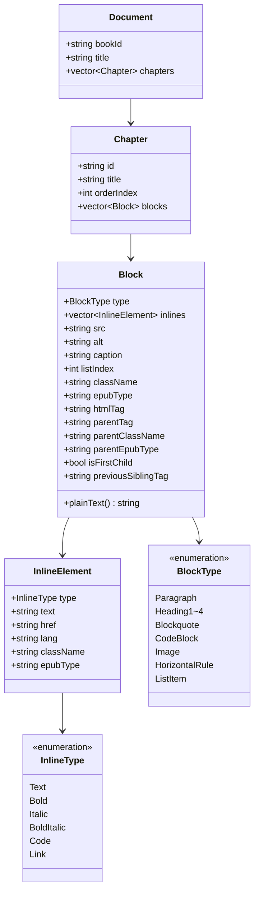

### 4.2 样式模型

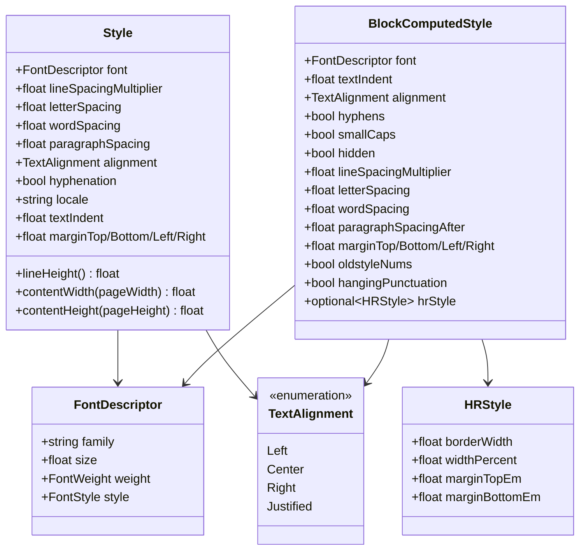

`Style` 表示用户的全局阅读偏好（字体、字号、行距等）。`BlockComputedStyle` 表示每个块级元素的最终计算样式，由引擎默认值 + CSS 规则 + 用户偏好三层合并而成。

### 4.3 输出模型

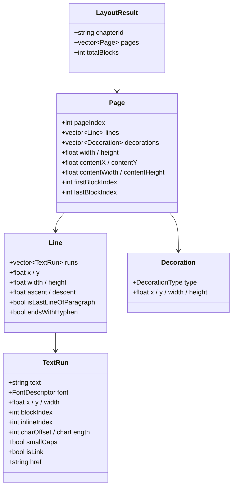

`TextRun` 是最小渲染单元，携带文本内容、精确坐标（以页面左上角为原点）、字体描述以及回溯源文档的索引信息（用于 TTS 高亮、文本选择等场景）。

### 4.4 CSS 模型

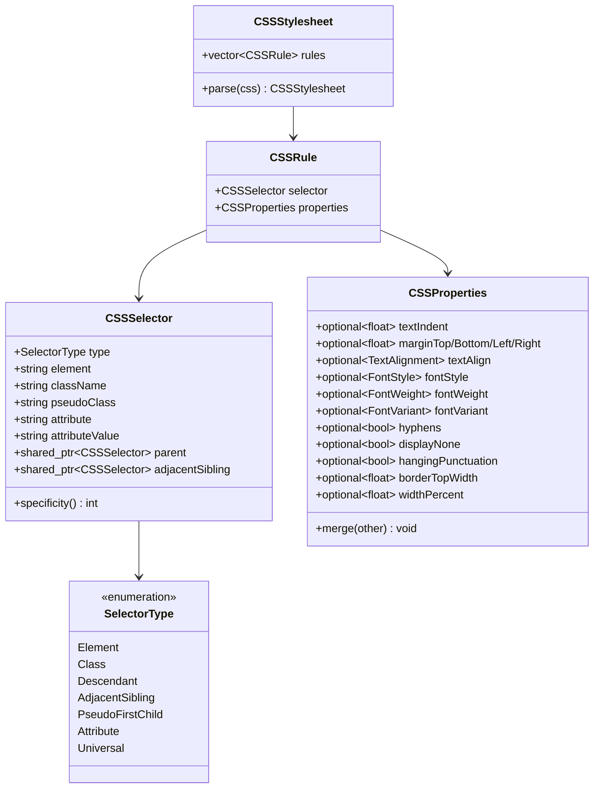

### 4.5 平台抽象模型

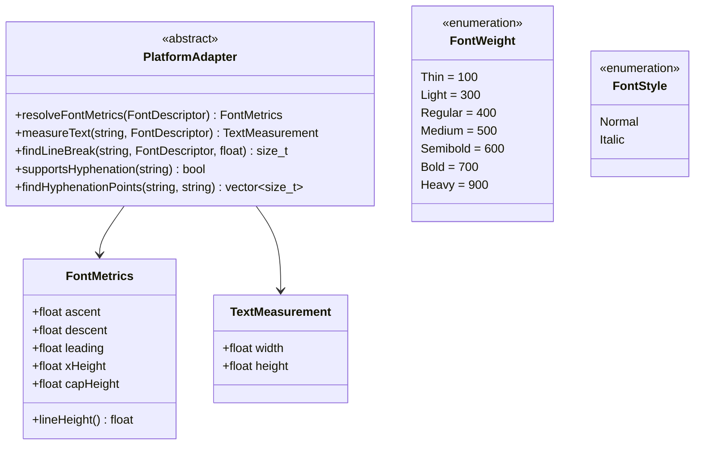

---

## 5. 模块详细设计

### 5.1 平台抽象层 (PlatformAdapter)

**文件**：`include/typesetting/platform.h`

**职责**：定义字体度量和文本测量的抽象接口，使排版核心与平台实现解耦。

**接口说明**：

| 方法 | 输入 | 输出 | 说明 |
|------|------|------|------|
| `resolveFontMetrics` | `FontDescriptor` | `FontMetrics` | 解析字体描述符，返回 ascent/descent/leading 等度量 |
| `measureText` | `text`, `FontDescriptor` | `TextMeasurement` | 测量文本宽度和高度 |
| `findLineBreak` | `text`, `FontDescriptor`, `maxWidth` | `size_t` | 查找不超过 maxWidth 的最佳断行位置（字节索引） |
| `supportsHyphenation` | `locale` | `bool` | 检查给定语言是否支持断词 |
| `findHyphenationPoints` | `word`, `locale` | `vector<size_t>` | 返回单词的合法断词位置 |

**不变性保证**：PlatformAdapter 接口在整个项目演进过程中保持不变。现有的 `FontDescriptor`（family/size/weight/style）足以覆盖所有 CSS 字体需求。小型大写（small-caps）等高级排版特性由引擎层或平台渲染层处理，不需要扩展 PlatformAdapter。

### 5.2 HTML 解析器 (Document)

**文件**：`include/typesetting/document.h`, `src/document.cpp`

**职责**：将 HTML 字符串解析为结构化的 Block/InlineElement 文档树。

#### 解析流程

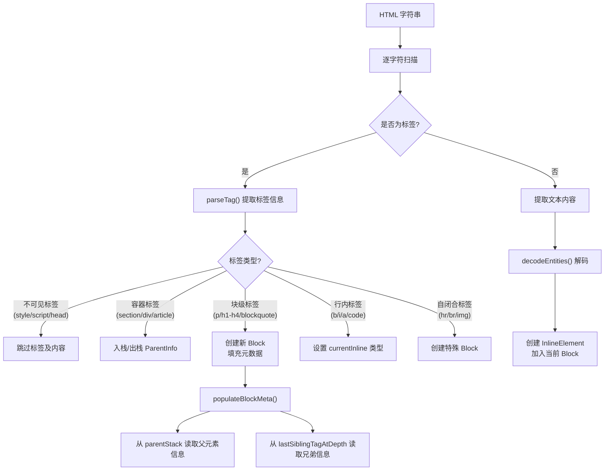

#### 父元素追踪

HTML 解析器维护一个 `parentStack`（类型 `vector<ParentInfo>`），用于追踪当前元素的祖先信息，为 CSS 后代选择器（如 `blockquote p`）提供匹配数据：

```
<section class="chapter">     → parentStack.push({tag:"section", class:"chapter"})
  <p>Text</p>                 → block.parentTag="section", block.parentClassName="chapter"
</section>                     → parentStack.pop()
```

#### 兄弟元素追踪

使用 `lastSiblingTagAtDepth` 数组追踪每个嵌套深度上最后一个块级元素的标签名，为 CSS 相邻兄弟选择器（如 `h2 + p`）提供匹配数据。

#### HTML 实体解码

支持的 HTML 实体：

| 实体 | 字符 | 实体 | 字符 |
|------|------|------|------|
| `&amp;` | & | `&mdash;` | — |
| `&lt;` | < | `&ndash;` | – |
| `&gt;` | > | `&hellip;` | … |
| `&quot;` | " | `&lsquo;` / `&rsquo;` | ' / ' |
| `&nbsp;` | (空格) | `&ldquo;` / `&rdquo;` | " / " |

### 5.3 CSS 解析器 (CSSStylesheet)

**文件**：`include/typesetting/css.h`, `src/css.cpp`

**职责**：将 CSS 字符串解析为结构化的 `CSSStylesheet`（规则列表）。

#### 解析流程

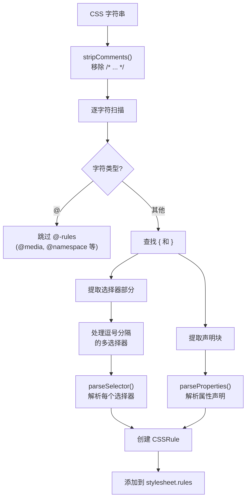

#### 选择器解析

选择器解析器通过 `parseSelector()` 函数将选择器字符串解析为 `CSSSelector` 结构。解析逻辑：

1. **检查 `+` 符号**：若包含，解析为 `AdjacentSibling` 类型
2. **按空白分词**：
   - 单个 token → 判断为 Element / Class / PseudoFirstChild / Attribute / Universal
   - 多个 token → 解析为 `Descendant` 类型，构建 parent 链
3. **特殊前缀**：`[` 开头为 Attribute，`.` 开头为 Class，`*` 为 Universal
4. **伪类**：通过 `:` 分割 element 和 pseudo-class 部分

#### 支持的选择器类型

| 类型 | 语法示例 | CSSSelector 字段 |
|------|---------|-----------------|
| 元素选择器 | `p`, `h2` | `type=Element, element="p"` |
| 类选择器 | `.classname` | `type=Class, className="classname"` |
| 后代选择器 | `blockquote p` | `type=Descendant, element="p", parent→element="blockquote"` |
| 相邻兄弟选择器 | `h2 + p` | `type=AdjacentSibling, element="p", adjacentSibling→element="h2"` |
| 伪类选择器 | `p:first-child` | `type=PseudoFirstChild, element="p", pseudoClass="first-child"` |
| 属性选择器 | `[epub\|type~="dedication"]` | `type=Attribute, attribute="epub:type", attributeValue="dedication"` |
| 通配选择器 | `*` | `type=Universal` |

#### 属性解析

`parseProperties()` 解析 CSS 声明块，支持以下属性：

| CSS 属性 | 解析逻辑 |
|---------|---------|
| `text-indent` | 解析数值 + 单位，存为 em 值 |
| `text-align` | 映射到 `TextAlignment` 枚举 |
| `font-style` | `italic` / `normal` |
| `font-weight` | `bold` / `normal` / 数值 |
| `font-variant` | `small-caps` / `normal` |
| `hyphens` | `auto` → true, `none` → false |
| `display` | `none` → displayNone=true |
| `margin` | 支持 1-4 值简写（含 `auto` 关键字） |
| `margin-top/bottom/left/right` | 独立边距属性 |
| `border-top` | 提取像素宽度值 |
| `width` | 百分比值（如 `25%`） |
| `hanging-punctuation` | `first` / `last` / `first last` / `none` |

#### Specificity 计算

选择器优先级按 CSS 标准的 (id, class, element) 三元组计算，编码为 `ids * 100 + classes * 10 + elements`：

| 选择器 | 计算 | Specificity |
|--------|------|------------|
| `p` | (0,0,1) | 1 |
| `.class` | (0,1,0) | 10 |
| `p:first-child` | (0,1,1) | 11 |
| `h2 + p` | (0,0,2) | 2 |
| `blockquote p` | (0,0,2) | 2 |
| `.parent p` | (0,1,1) | 11 |

对于复合选择器，递归累加 parent 和 adjacentSibling 的 specificity。

### 5.4 样式解析器 (StyleResolver)

**文件**：`include/typesetting/style_resolver.h`, `src/style_resolver.cpp`

**职责**：将 CSS 规则 + 用户 Style + Block 元数据合并为每个 Block 的最终计算样式。

#### 解析流程

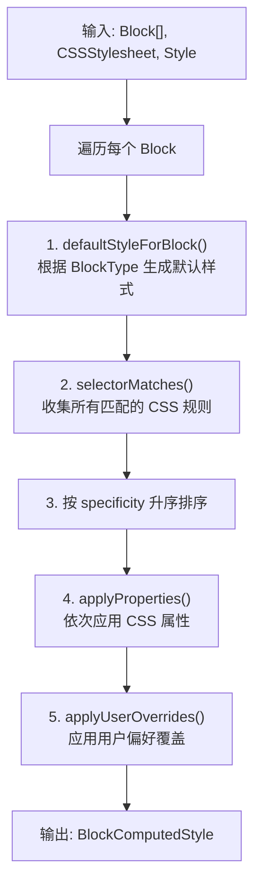

#### 默认样式映射

引擎为每种 `BlockType` 预设合理的默认样式：

| BlockType | 字号比例 | 对齐方式 | 缩进 | 特殊属性 |
|-----------|---------|---------|------|---------|
| Paragraph | 1.0x | Justified | 1em | hyphens=true |
| Heading1 | 1.5x | Center | 0 | smallCaps, hyphens=false |
| Heading2 | 1.3x | Center | 0 | smallCaps, hyphens=false |
| Heading3 | 1.1x | Center | 0 | smallCaps, hyphens=false |
| Heading4 | 1.0x | Center | 0 | smallCaps, hyphens=false |
| Blockquote | 1.0x | Justified | 0 | marginLeft/Right=2.5em |
| CodeBlock | 0.9x (monospace) | Left | 0 | hyphens=false |
| HorizontalRule | — | — | — | hrStyle 默认值 |
| ListItem | 1.0x | Justified | 0 | marginLeft=2em |

#### 选择器匹配

`selectorMatches()` 方法针对每种 `SelectorType` 执行不同的匹配逻辑：

| SelectorType | 匹配逻辑 |
|-------------|---------|
| Element | `block.htmlTag` (或 `blockTypeToTag(block.type)`) == selector.element |
| Class | `block.className` 的空格分隔列表中包含 selector.className |
| Descendant | 主元素匹配当前 block + parent 选择器匹配 block.parentTag/parentClassName/parentEpubType |
| AdjacentSibling | 主元素匹配当前 block + adjacentSibling 匹配 block.previousSiblingTag |
| PseudoFirstChild | 元素匹配 + block.isFirstChild == true |
| Attribute | block.epubType 或 block.parentEpubType 包含 attributeValue |
| Universal | 始终匹配 |

#### 用户偏好覆盖规则

| 用户 Style 属性 | 覆盖行为 |
|----------------|---------|
| `font.family` | **始终覆盖**所有 Block |
| `font.size` | 覆盖正文 Block；标题和代码块保持相对比例 |
| `lineSpacingMultiplier` | **始终覆盖** |
| `letterSpacing` / `wordSpacing` | **始终覆盖** |
| `paragraphSpacing` | **始终覆盖** |
| `alignment` | 覆盖，**除非** Block 是标题且 CSS 设为 Center |
| `hyphenation` | 覆盖，**除非** CSS 显式设置 `hyphens: none` |
| `textIndent` | **不覆盖**（由 CSS 控制） |
| `margin*` | 作为**页面边距**，不影响 Block 级别的 CSS margin |

### 5.5 排版引擎 (LayoutEngine)

**文件**：`include/typesetting/layout.h`, `src/layout.cpp`

**职责**：将文档块 + 计算样式 + 页面尺寸转换为精确定位的排版结果。

#### 排版流程

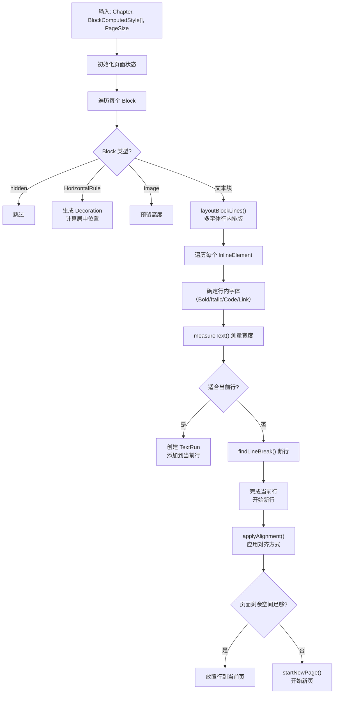

#### 行内排版算法 (layoutBlockLines)

核心行内排版逻辑：

1. **逐 InlineElement 处理**：不再拼接全文，而是按 InlineElement 逐段处理
2. **字体选择**：根据 InlineType（Bold→FontWeight::Bold, Italic→FontStyle::Italic, Code→monospace）确定字体
3. **宽度测量**：使用 `platform_->measureText()` 测量每段文本
4. **断行**：当累积宽度超过可用宽度时，使用 `platform_->findLineBreak()` 查找断行位置
5. **首行缩进**：第一行 `lineX` 初始值为 `textIndent`，`effectiveWidth` 减去缩进量
6. **行首空格跳过**：新行开始时跳过前导空格
7. **强制推进**：当完全无法容纳时，至少推进一个 UTF-8 字符（防止无限循环）
8. **基线对齐**：同一行内不同字体的 TextRun 按最大 ascent 值对齐基线

#### 文本对齐 (applyAlignment)

| 对齐方式 | 实现 |
|---------|------|
| Left | 默认，不做处理 |
| Center | 所有 TextRun 的 x 坐标加上 `extraSpace / 2` |
| Right | 所有 TextRun 的 x 坐标加上 `extraSpace` |
| Justified | 调用 `justifyLine()`（段落最后一行除外） |

#### 两端对齐算法 (justifyLine)

```
1. 统计行内所有 TextRun 中的空格总数 spaceCount
2. 计算 extraPerSpace = (contentWidth - lineWidth) / spaceCount
3. 从第一个 run 开始，逐个 run 重新计算：
   - run.x = xCursor
   - run.width += spacesInRun * extraPerSpace
   - xCursor += run.width
4. 设置 line.width = contentWidth
```

#### 分页算法

- 维护 `cursorY` 追踪当前页面已使用的垂直空间
- 当 `cursorY + lineHeight > contentHeight` 且当前页不为空时，触发分页
- `startNewPage()` 保存当前页，创建新页，重置 `cursorY`
- 块级元素的 `marginTop` 和 `marginBottom` / `paragraphSpacingAfter` 参与垂直空间计算

#### 特殊 Block 处理

| Block 类型 | 处理方式 |
|-----------|---------|
| HorizontalRule | 根据 `hrStyle` 计算 margin、border 宽度、居中位置，生成 `Decoration` 对象 |
| Image | 预留 `contentWidth * 0.6` 高度 |
| Hidden (display:none) | 完全跳过，不参与排版 |

### 5.6 引擎门面 (Engine)

**文件**：`include/typesetting/engine.h`, `src/engine.cpp`

**职责**：提供统一的排版 API，协调各模块的调用顺序。

#### 公开接口

| 方法 | 说明 |
|------|------|
| `layoutHTML(html, chapterId, style, pageSize)` | 基础排版：HTML 解析 → 默认样式 → 排版 |
| `layoutHTML(html, css, chapterId, style, pageSize)` | CSS 排版：HTML 解析 + CSS 解析 → 样式计算 → 排版 |
| `layoutBlocks(blocks, chapterId, style, pageSize)` | 直接排版预解析的 Block 列表 |
| `relayout(style, pageSize)` | 使用缓存的 Block 和 CSS 重新排版（字体大小变更场景） |
| `platform()` | 获取平台适配器实例 |

#### 缓存机制

Engine 缓存上次排版的中间结果，支持 `relayout()` 时快速重排：

| 缓存字段 | 用途 |
|---------|------|
| `lastBlocks_` | 上次解析的 Block 列表 |
| `lastChapterId_` | 上次排版的章节 ID |
| `lastStylesheet_` | 上次解析的 CSS 样式表 |
| `hasStylesheet_` | 是否有 CSS 样式表 |
| `lastStyles_` | 上次计算的 BlockComputedStyle 列表 |

`relayout()` 逻辑：

```
if (有缓存的 stylesheet) {
    重新解析样式（因为 userStyle 可能变了）
    使用 BlockComputedStyle 重排
} else {
    使用 Style 直接重排
}
```

#### 辅助模块：LineBreaker

**文件**：`src/linebreaker.cpp`

**职责**：提供行断裂相关的工具函数（当前作为备用模块保留）。

| 函数 | 说明 |
|------|------|
| `utf8CharLen()` | 返回 UTF-8 字符的字节长度 |
| `charCountToByteOffset()` | UTF-16 字符计数 → UTF-8 字节偏移转换 |
| `findBreakPoints()` | 查找文本中所有候选断行位置（空格、连字符） |
| `breakGreedy()` | 贪心断行算法 |

---

## 6. 平台绑定层

### 6.1 iOS 绑定 (TypesettingBridge)

**文件**：`bindings/swift/TypesettingBridge.h`, `bindings/swift/TypesettingBridge.mm`

**职责**：将 C++ 排版引擎封装为 Objective-C 接口，供 iOS/macOS 应用调用。

#### 平台适配器实现

`CoreTextAdapter` 实现 `PlatformAdapter` 接口，使用 iOS CoreText 框架：

| PlatformAdapter 方法 | CoreText 实现 |
|---------------------|-------------|
| `resolveFontMetrics()` | `CTFontCreateWithName` → `CTFontGetAscent/Descent/Leading/XHeight/CapHeight` |
| `measureText()` | `CTLineCreateWithAttributedString` → `CTLineGetTypographicBounds` |
| `findLineBreak()` | `CTTypesetterCreateWithAttributedString` → `CTTypesetterSuggestLineBreak` |
| `supportsHyphenation()` | `CFLocaleCopyCurrent` → 语言代码匹配 |
| `findHyphenationPoints()` | 返回空列表（TODO: 使用 `CFStringGetHyphenationLocationBeforeIndex`） |

#### 数据类型映射

| C++ 类型 | Objective-C 类型 |
|---------|-----------------|
| `LayoutResult` | `TSLayoutResult` |
| `Page` | `TSPage` |
| `Line` | `TSLine` |
| `TextRun` | `TSTextRun` |
| `Decoration` | `TSDecoration` |
| `Style` | `TSStyle` |

#### API

```objc
@interface TypesettingBridge : NSObject
- (TSLayoutResult *)layoutHTML:(NSString *)html
                     chapterId:(NSString *)chapterId
                         style:(TSStyle *)style
                     pageWidth:(CGFloat)pageWidth
                    pageHeight:(CGFloat)pageHeight;

- (TSLayoutResult *)layoutHTML:(NSString *)html
                           css:(NSString *)css
                     chapterId:(NSString *)chapterId
                         style:(TSStyle *)style
                     pageWidth:(CGFloat)pageWidth
                    pageHeight:(CGFloat)pageHeight;

- (TSLayoutResult *)relayoutWithStyle:(TSStyle *)style
                            pageWidth:(CGFloat)pageWidth
                           pageHeight:(CGFloat)pageHeight;
@end
```

### 6.2 Android 绑定 (TypesettingJNI)

**文件**：`bindings/jni/TypesettingJNI.h`, `bindings/jni/TypesettingJNI.cpp`

**职责**：通过 JNI 将 C++ 排版引擎暴露给 Android/Kotlin 应用。

#### 平台适配器实现

`AndroidPlatformAdapter` 实现 `PlatformAdapter` 接口，通过 JNI 回调 Java 层的 `MeasureHelper`：

| PlatformAdapter 方法 | JNI 实现 |
|---------------------|---------|
| `resolveFontMetrics()` | JNI 调用 `measureHelper.getFontMetrics(family, size, weight, isItalic)` |
| `measureText()` | JNI 调用 `measureHelper.measureText(text, family, size, weight, isItalic)` |
| `findLineBreak()` | JNI 调用 `measureHelper.findLineBreak(...)` + UTF-16↔UTF-8 转换 |
| `supportsHyphenation()` | 返回 false（TODO） |
| `findHyphenationPoints()` | 返回空列表（TODO） |

#### UTF-8 安全处理

JNI 层包含 `safeNewStringUTF()` 函数，在创建 JNI 字符串前验证 UTF-8 编码有效性，防止在多字节字符中间截断导致的崩溃。

#### JNI 函数

| JNI 函数 | 说明 |
|---------|------|
| `nativeCreate(measureHelper)` | 创建 Engine 实例，持有 AndroidPlatformAdapter |
| `nativeDestroy(ptr)` | 释放 Engine 实例 |
| `nativeLayoutHTML(ptr, html, css, chapterId, style, pageWidth, pageHeight)` | 排版入口 |
| `nativeRelayout(ptr, style, pageWidth, pageHeight)` | 重新排版 |

#### 内存管理

- `AndroidPlatformAdapter` 使用 `GlobalRef` 持有 `measureHelper` 对象引用
- `nativeCreate` 返回 `jlong` 指针，`nativeDestroy` 释放
- 嵌套循环中使用 `DeleteLocalRef` 避免局部引用表溢出

---

## 7. 数据流

### 7.1 完整排版流程

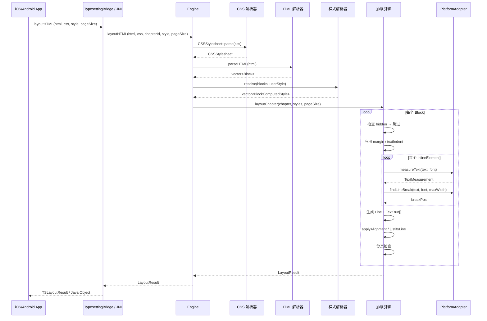

### 7.2 重新排版流程

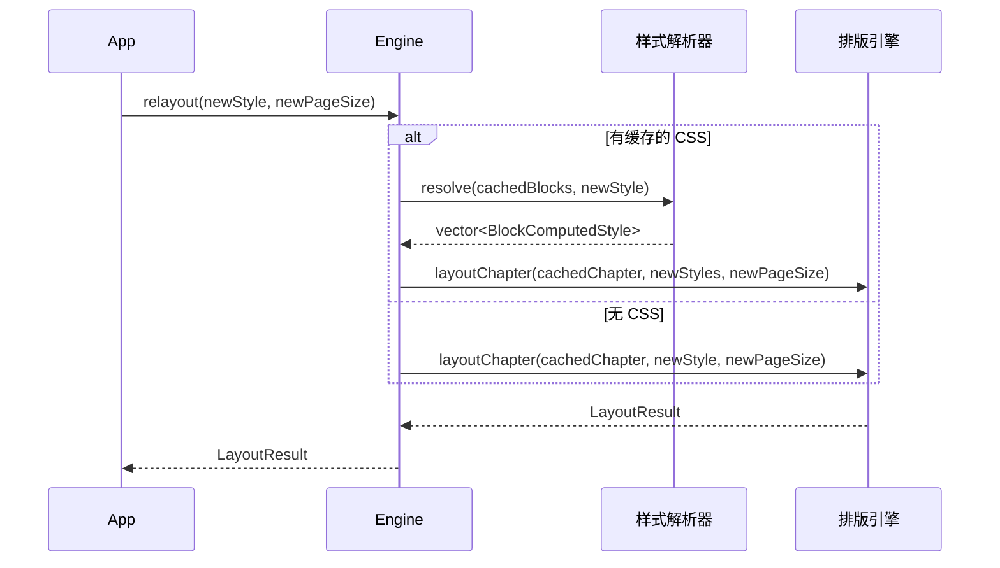

---

## 8. 关键算法

### 8.1 多字体行内排版

同一行可包含多种字体的 TextRun（如正文中嵌入粗体、斜体、代码片段）。算法要点：

```
对于 Block 中的每个 InlineElement:
  1. 根据 InlineType 确定 FontDescriptor:
     - Text → block 基础字体
     - Bold → weight=Bold
     - Italic → style=Italic
     - BoldItalic → weight=Bold + style=Italic
     - Code → family="monospace", size=0.9x
     - Link → 标记 isLink=true

  2. 获取该字体的 FontMetrics, 更新行内最大 ascent/descent

  3. 处理文本:
     while (remaining 不为空):
       - 跳过行首空格
       - 测量 remaining 宽度
       - 若适合 → 创建 TextRun, 推进 lineX
       - 若不适合 → findLineBreak() 断行
         - 断行位置 > 0 → 创建 TextRun + 完成当前行
         - 断行位置 == 0 → 行为空时强制推进; 否则完成行后重试
```

### 8.2 UTF-8 安全处理

引擎在多处确保 UTF-8 编码的正确处理：

| 场景 | 处理方式 |
|------|---------|
| 强制断行 | 根据 lead byte (0x80-0xF8) 计算字符字节数，确保不在字符中间断开 |
| JNI 字符串 | `safeNewStringUTF()` 验证编码有效性后再传递给 JNI |
| UTF-16↔UTF-8 | `charCountToByteOffset()` 正确处理 surrogate pair（4 字节 UTF-8 = 2 UTF-16 字符） |

### 8.3 CSS Specificity 排序

样式计算时，匹配到同一 Block 的多条 CSS 规则按 specificity 升序排列，低优先级规则先应用，高优先级规则后覆盖，确保 CSS 级联规则的正确性。

---

## 9. 样式层叠与优先级

排版引擎实现三层样式优先级，从低到高：


| 层级 | 来源 | 示例 |
|------|------|------|
| 1 | 引擎默认值 | Paragraph → textIndent=1em, alignment=Justified |
| 2 | CSS 规则 | `h2 + p { text-indent: 0 }` 覆盖段落默认缩进 |
| 3 | 用户偏好 | 用户设置 font.size=20 覆盖基础字号 |

**设计要点**：用户偏好不应完全覆盖所有 CSS 属性。例如：
- 标题应保持居中（即使用户设置 alignment=Justified）
- CSS 明确设置 `hyphens: none` 的标题不应被用户的 hyphenation=true 覆盖
- `textIndent` 由 CSS 控制，用户不参与覆盖

---

## 10. SE CSS 支持

引擎专门针对 [Standard Ebooks](https://standardebooks.org/) 格式的 CSS 进行了优化。以下是需要支持的关键 CSS 规则：

| SE CSS 规则 | 引擎处理方式 |
|------------|-------------|
| `b, strong { font-variant: small-caps; font-weight: normal; }` | Bold InlineType → smallCaps=true, weight=Regular |
| `h1-h6 { font-variant: small-caps; text-align: center; }` | 标题 Block → smallCaps + Center |
| `p { text-indent: 1em; }` | 段落默认缩进 = 1 × 用户字号 |
| `h2 + p { text-indent: 0; }` | 通过 previousSiblingTag=="h2" 匹配 |
| `hr + p { text-indent: 0; }` | 通过 previousSiblingTag=="hr" 匹配 |
| `p:first-child { text-indent: 0; }` | 通过 isFirstChild 匹配 |
| `.class p { font-style: italic; }` | 后代选择器匹配 parentClassName |
| `section[epub\|type~="dedication"] p { ... }` | 属性选择器匹配 parentEpubType |
| `blockquote { margin: 1em 2.5em; }` | em → px 转换后应用 margin |
| `hr { border-top: 1px solid; width: 25%; }` | 生成 Decoration，居中绘制 |
| `display: none` | BlockComputedStyle.hidden = true |
| `hyphens: none` | 标题等元素禁用断词 |

**@-rules 处理**：`@media`, `@supports`, `@namespace`, `@font-face` 等 @-rules 在解析阶段被跳过，不参与样式计算。

---

## 11. 构建与测试

### 11.1 构建配置

项目使用 CMake 构建，提供三个预设：

| 预设 | 用途 | 测试 | 优化 |
|------|------|------|------|
| `debug` | 开发调试 | ✅ 开启 | Debug |
| `release` | 发布构建 | ❌ 关闭 | Release |
| `ci` | 持续集成 | ✅ 开启 | Release |

构建命令：

```bash
# Debug 构建（含测试）
cmake --preset debug
cmake --build build/debug

# Release 构建
cmake --preset release
cmake --build build/release

# 或手动指定
cmake -B build -DCMAKE_BUILD_TYPE=Release -DTYPESETTING_BUILD_TESTS=ON
cmake --build build
```

### 11.2 测试策略

项目使用 GoogleTest v1.14.0 框架，通过 CMake FetchContent 自动下载。

#### 测试文件

| 文件 | 覆盖范围 | 测试数量 |
|------|---------|---------|
| `test_css.cpp` | CSS 选择器解析、属性解析、specificity、注释处理 | 14 个测试 |
| `test_layout.cpp` | HTML 解析、分页排版、重排版、文本缩进、对齐、多字体 | 18 个测试 |
| `test_style_resolver.cpp` | 默认样式、CSS 覆盖、用户偏好覆盖、选择器匹配 | 20+ 个测试 |

#### 测试用 Mock

`MockPlatformAdapter` 使用固定宽度字体度量（每字符 8px），确保排版结果可预测：

```cpp
class MockPlatformAdapter : public PlatformAdapter {
    FontMetrics resolveFontMetrics(const FontDescriptor& desc) override {
        return {desc.size * 0.8f,  // ascent
                desc.size * 0.2f,  // descent
                desc.size * 0.1f,  // leading
                desc.size * 0.5f,  // xHeight
                desc.size * 0.7f}; // capHeight
    }
    TextMeasurement measureText(const std::string& text, const FontDescriptor& font) override {
        return {static_cast<float>(text.size()) * font.size * 0.5f, font.size};
    }
    size_t findLineBreak(const std::string& text, const FontDescriptor& font, float maxWidth) override {
        float charWidth = font.size * 0.5f;
        // 寻找不超过 maxWidth 的最后一个空格位置
        ...
    }
};
```

运行测试：

```bash
cmake -B build -DTYPESETTING_BUILD_TESTS=ON
cmake --build build
ctest --test-dir build --output-on-failure
```

---

## 12. 文件清单

### 公共头文件 (`include/typesetting/`)

| 文件 | 模块 | 主要定义 |
|------|------|---------|
| `platform.h` | 平台抽象 | `PlatformAdapter`, `FontDescriptor`, `FontMetrics`, `TextMeasurement`, `FontWeight`, `FontStyle` |
| `document.h` | 文档模型 | `Block`, `InlineElement`, `Chapter`, `Document`, `BlockType`, `InlineType`, `parseHTML()` |
| `css.h` | CSS 解析 | `CSSStylesheet`, `CSSRule`, `CSSSelector`, `CSSProperties`, `SelectorType`, `FontVariant` |
| `style.h` | 样式模型 | `Style`, `BlockComputedStyle`, `HRStyle`, `TextAlignment` |
| `style_resolver.h` | 样式计算 | `StyleResolver` |
| `layout.h` | 排版引擎 | `LayoutEngine`, `PageSize` |
| `page.h` | 输出模型 | `Page`, `Line`, `TextRun`, `Decoration`, `LayoutResult`, `DecorationType` |
| `engine.h` | 引擎门面 | `Engine` |

### 实现文件 (`src/`)

| 文件 | 职责 | 代码量 |
|------|------|-------|
| `document.cpp` | HTML 解析实现 | ~400 行 |
| `css.cpp` | CSS 解析实现 | ~550 行 |
| `style_resolver.cpp` | 样式计算实现 | ~370 行 |
| `layout.cpp` | 排版引擎实现（含 Pimpl） | ~500 行 |
| `engine.cpp` | 引擎门面实现 | ~70 行 |
| `linebreaker.cpp` | 断行工具函数（备用） | ~110 行 |
| `style.cpp` | 样式扩展点（占位） | ~10 行 |
| `page.cpp` | 页面扩展点（占位） | ~10 行 |

### 绑定层

| 文件 | 平台 | 职责 |
|------|------|------|
| `bindings/swift/TypesettingBridge.h` | iOS | Objective-C 接口定义 |
| `bindings/swift/TypesettingBridge.mm` | iOS | CoreText 适配器 + 桥接实现 |
| `bindings/jni/TypesettingJNI.h` | Android | JNI 函数声明 |
| `bindings/jni/TypesettingJNI.cpp` | Android | Android 适配器 + JNI 实现 |

### 测试文件 (`tests/`)

| 文件 | 覆盖模块 |
|------|---------|
| `test_css.cpp` | CSS 解析 |
| `test_layout.cpp` | HTML 解析 + 排版 |
| `test_style_resolver.cpp` | 样式计算 |
| `CMakeLists.txt` | 测试构建配置 |

---

## 13. 向后兼容性

| 场景 | 保证 |
|------|------|
| 无 CSS 调用 | `layoutHTML(html, chapterId, style, pageSize)` 签名保留不变，行为等同原始版本 |
| Block 新增字段 | 所有新增字段有默认值，现有构造方式不受影响 |
| TextRun 新增字段 | `smallCaps=false`, `isLink=false`, `href=""`——现有渲染代码可忽略 |
| Page 新增 decorations | 默认为空向量，现有渲染代码不受影响 |
| LayoutEngine 双重载 | `layoutChapter(Style)` 和 `layoutChapter(BlockComputedStyle[])` 并存 |

---

## 14. 交互层 (Interaction Module)

### 14.1 概述

交互层是排版引擎的**查询扩展**，在排版完成后为平台层提供命中测试、文本选择、TTS 高亮等交互能力。交互层不修改排版结果，仅基于缓存的 `LayoutResult` 进行只读查询。

### 14.2 功能矩阵

| # | 功能 | 引擎层职责 | 平台层职责 |
|---|------|-----------|-----------|
| 1 | 段落双击事件 | 命中测试 + 段落矩形查询 | 手势识别 + 业务回调 |
| 2 | TTS 句子高亮 | 句子分割 + 字符范围→视觉矩形 | TTS 播放 + 高亮层绘制 |
| 3 | 自动翻页 | 无改动（已提供页数） | 定时器 + 翻页控制 |
| 4 | 分词 | 词边界查找 | 无 |
| 5 | 长按划线 | 字符命中测试 + 范围→矩形 | 手势处理 + 高亮层绘制 |
| 6 | 仿真翻页 | 无改动 | 翻页动画渲染 |
| 7 | 封面展示 | 封面页排版 API | 图片加载 + 渲染 |
| 8 | 内嵌图片显示 | 无改动（已支持 Decoration 输出） | 图片加载 + 渲染 |
| 9 | 图片点击放大 | 图片命中测试 | 点击事件 + 缩放查看器 |
| 10 | 章节标题显示 | PageInfo 元数据输出 | margin 区域内绘制 |
| 11 | 阅读进度显示 | PageInfo 进度计算 | margin 区域内绘制 |

### 14.3 架构位置

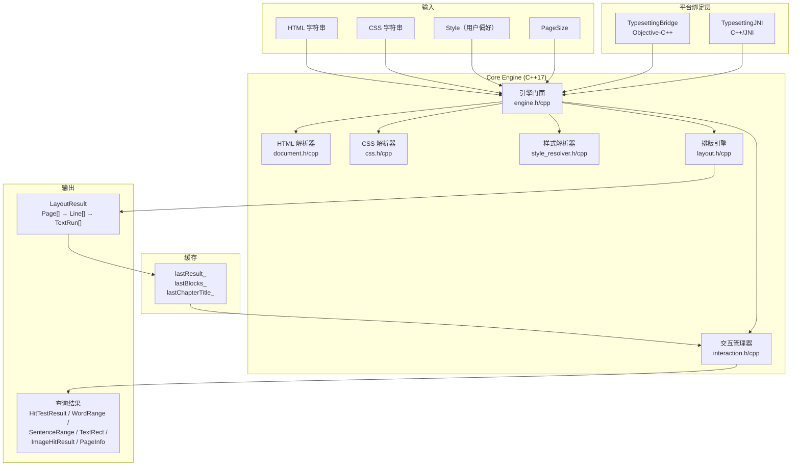

### 14.4 数据流

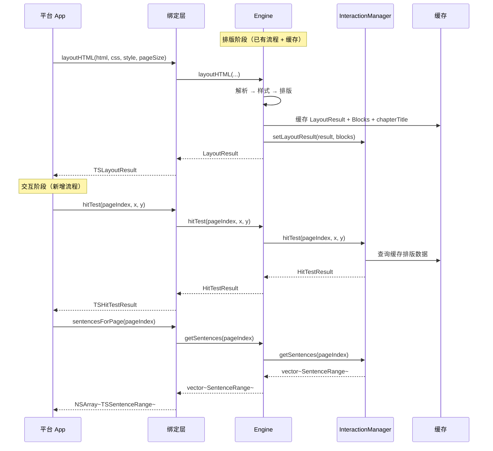

---

## 15. 交互层数据模型

### 15.1 数据结构

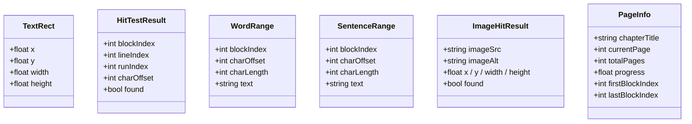

### 15.2 charOffset 坐标系

交互层统一使用 **Block plainText 偏移** 作为字符定位坐标系。

| 字段 | 坐标系 | 说明 |
|------|--------|------|
| `TextRun.charOffset` | InlineElement 内偏移 | 排版输出的原始偏移，相对于所属 `InlineElement.text` |
| `HitTestResult.charOffset` | Block plainText 偏移 | 相对于 `block.plainText()` 的字节偏移 |
| `WordRange.charOffset` | Block plainText 偏移 | 同上 |
| `SentenceRange.charOffset` | Block plainText 偏移 | 同上 |
| `getRectsForRange` 输入参数 | Block plainText 偏移 | 同上 |

**坐标转换关系**：

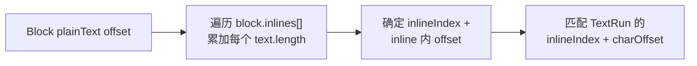

转换公式：`blockOffset = sum(inlines[0..i-1].text.length) + inlineCharOffset`

---

## 16. 交互层 API

### 16.1 Engine 新增接口

| 方法 | 输入 | 输出 | 用途 | 服务的功能 |
|------|------|------|------|-----------|
| `layoutCover` | imageSrc, pageSize | Page | 生成封面页 | 封面展示 |
| `hitTest` | pageIndex, x, y | HitTestResult | 坐标→字符级命中测试 | 双击、长按 |
| `wordAtPoint` | pageIndex, x, y | WordRange | 获取点击位置的词 | 分词、长按划线 |
| `getSentences` | pageIndex | vector\<SentenceRange\> | 获取页面内句子边界 | TTS 高亮 |
| `getAllSentences` | 无 | vector\<SentenceRange\> | 获取全章节句子边界 | TTS 高亮 |
| `getRectsForRange` | pageIndex, blockIndex, charOffset, charLength | vector\<TextRect\> | 字符范围→视觉矩形 | TTS 高亮、长按划线 |
| `getBlockRect` | pageIndex, blockIndex | TextRect | 段落整体矩形 | 双击段落 |
| `hitTestImage` | pageIndex, x, y | ImageHitResult | 图片命中测试 | 图片点击放大 |
| `getPageInfo` | pageIndex | PageInfo | 页面元信息 | 章节标题、阅读进度 |

### 16.2 InteractionManager 职责

| 职责 | 说明 |
|------|------|
| 持有缓存 | 保存最近一次 `LayoutResult` 和 `vector<Block>` 的拷贝 |
| 查询委托 | Engine 将所有交互查询方法委托给 InteractionManager |
| 坐标转换 | 在 Block plainText 偏移 ↔ (inlineIndex, charOffset) 之间双向转换 |

---

## 17. 交互算法

### 17.1 命中测试 (hitTest)

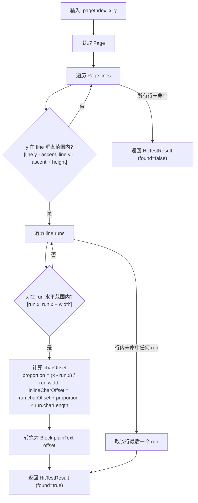

### 17.2 分词 (wordAtPoint)

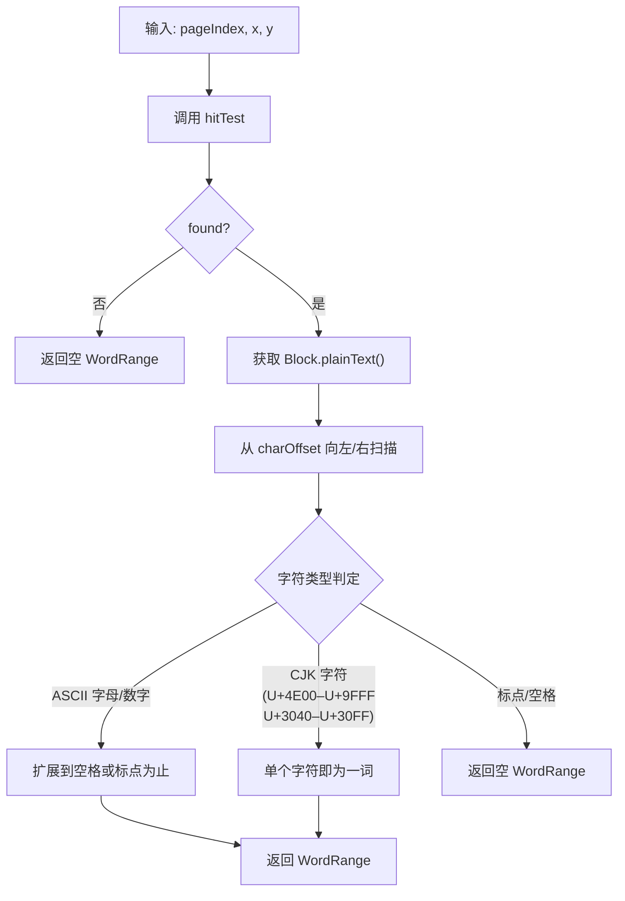

### 17.3 句子分割 (getSentences)

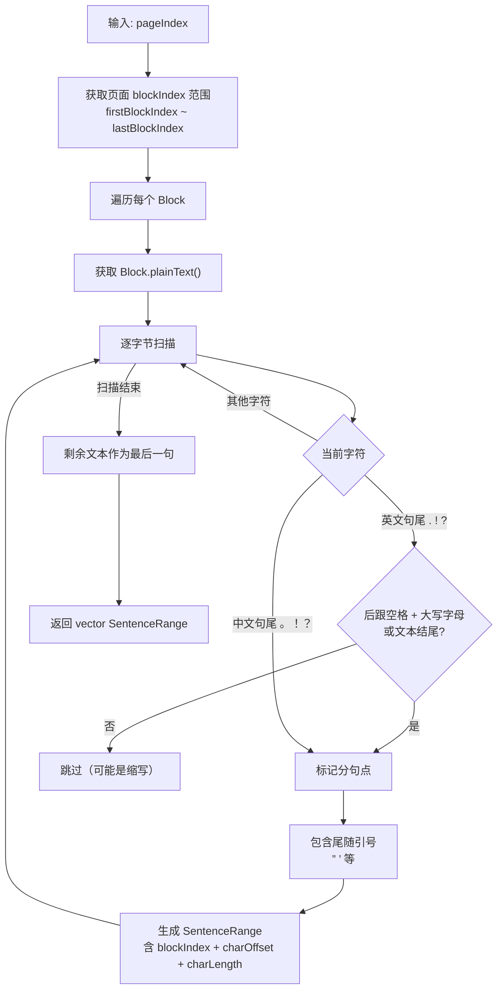

### 17.4 范围→矩形 (getRectsForRange)

```mermaid
flowchart TD
    A["输入: pageIndex, blockIndex,<br/>charOffset, charLength"] --> B["将 charOffset/charLength<br/>转为请求范围 [reqStart, reqEnd)"]
    B --> C["遍历 Page.lines"]
    C --> D["遍历 line.runs"]
    D --> E{run.blockIndex == blockIndex?}
    E -- 否 --> D
    E -- 是 --> F["将 run 的 (inlineIndex, charOffset)<br/>转为 Block plainText 坐标"]
    F --> G["计算 run 范围<br/>[runStart, runEnd)"]
    G --> H{run 范围与请求范围重叠?}
    H -- 否 --> D
    H -- 是 --> I["计算重叠比例"]
    I --> J["裁剪 x 和 width<br/>startRatio = (overlapStart - runStart) / runLength<br/>endRatio = (overlapEnd - runStart) / runLength"]
    J --> K["生成 TextRect<br/>x = run.x + startRatio × run.width<br/>width = (endRatio - startRatio) × run.width<br/>y = line.y - line.ascent<br/>height = line.height"]
    K --> L["添加到结果"]
    L --> D
    D -- 结束 --> M["返回 vector TextRect"]
```

### 17.5 段落矩形 (getBlockRect)

遍历页面所有 line/run，收集 `blockIndex` 匹配的 run，计算 bounding box：

| 计算 | 值 |
|------|-----|
| minX | 所有匹配 run 的最小 `run.x` |
| minY | 所有匹配 line 的最小 `line.y - line.ascent` |
| maxX | 所有匹配 run 的最大 `run.x + run.width` |
| maxY | 所有匹配 line 的最大 `line.y - line.ascent + line.height` |
| 结果 | `TextRect{minX, minY, maxX - minX, maxY - minY}` |

### 17.6 图片命中测试 (hitTestImage)

```mermaid
flowchart TD
    A["输入: pageIndex, x, y"] --> B["获取 Page"]
    B --> C["遍历 Page.decorations"]
    C --> D{type == ImagePlaceholder?}
    D -- 否 --> C
    D -- 是 --> E{"(x, y) 在矩形内?<br/>deco.x ≤ x ≤ deco.x + deco.width<br/>deco.y ≤ y ≤ deco.y + deco.height"}
    E -- 否 --> C
    E -- 是 --> F["返回 ImageHitResult<br/>found=true, imageSrc, 矩形坐标"]
    C -- 遍历结束 --> G["返回 ImageHitResult (found=false)"]
```

---

## 18. 封面页

### 18.1 封面排版 (layoutCover)

```mermaid
flowchart TD
    A["输入: imageSrc, pageSize"] --> B["调用 platform.getImageSize(src)"]
    B --> C{获取到原始尺寸?}
    C -- 是 --> D["等比缩放 fit 到 pageSize<br/>scale = min(pageW/imgW, pageH/imgH)"]
    C -- 否 --> E["使用 pageSize 铺满"]
    D --> F["计算居中偏移<br/>offsetX = (pageW - scaledW) / 2<br/>offsetY = (pageH - scaledH) / 2"]
    E --> F
    F --> G["创建 Page"]
    G --> H["设置 pageIndex = -1"]
    H --> I["添加 Decoration<br/>type = ImagePlaceholder"]
    I --> J["返回 Page"]
```

### 18.2 封面页属性

| Page 字段 | 值 | 说明 |
|-----------|-----|------|
| `pageIndex` | -1 | 标记为封面，不计入正文页码 |
| `width` / `height` | pageSize | 页面尺寸 |
| `contentX` / `contentY` | 0 | 无 margin，全页可用 |
| `contentWidth` / `contentHeight` | pageSize | 全页可用 |
| `firstBlockIndex` / `lastBlockIndex` | -1 | 封面无关联 Block |

| Decoration 字段 | 值 |
|-----------------|-----|
| `type` | ImagePlaceholder |
| `x` / `y` | 居中偏移后的坐标 |
| `width` / `height` | 等比缩放后的尺寸 |
| `imageSrc` | 封面图片源 |

---

## 19. 页面元信息 (PageInfo)

### 19.1 设计决策

页眉（章节标题）和页脚（阅读进度）由平台层在 margin 区域内自行渲染，引擎仅提供元数据。

**理由**：

| 考量 | 引擎排版页眉页脚 | 引擎输出元数据（采用） |
|------|-----------------|---------------------|
| 关注点分离 | 违反——排版引擎决定 UI 装饰 | 遵守——引擎只管排版 |
| 灵活性 | 低——字体/颜色/样式硬编码 | 高——平台自由定制 |
| 复杂度 | 高——每页额外排版行 | 低——仅数据计算 |
| 跨平台一致性 | 强制一致 | 各平台用原生风格 |

### 19.2 PageInfo 字段

| 字段 | 类型 | 计算方式 |
|------|------|---------|
| `chapterTitle` | string | Engine 缓存的章节标题 |
| `currentPage` | int | pageIndex + 1（1-based 显示） |
| `totalPages` | int | LayoutResult.pages.size() |
| `progress` | float | (pageIndex + 1) / totalPages，范围 0.0 ~ 1.0 |
| `firstBlockIndex` | int | Page.firstBlockIndex |
| `lastBlockIndex` | int | Page.lastBlockIndex |

### 19.3 平台渲染布局

```mermaid
graph TB
    subgraph "完整页面 (pageSize)"
        subgraph "marginTop 区域"
            Header["← chapterTitle（左上角）"]
        end
        subgraph "排版内容区 (contentArea)"
            Content["Lines + TextRuns + Decorations"]
        end
        subgraph "marginBottom 区域"
            Footer["currentPage / totalPages（右下角） →"]
        end
    end

    style Header fill:#fff3e0,stroke:#f57c00
    style Footer fill:#fff3e0,stroke:#f57c00
    style Content fill:#f5f5f5,stroke:#9e9e9e
```

---

## 20. Engine 缓存变更

| 缓存字段 | 类型 | 来源 | 用途 |
|---------|------|------|------|
| `lastBlocks_` | `vector<Block>` | 已有 | HTML 解析结果 |
| `lastChapterId_` | `string` | 已有 | 章节 ID |
| `lastStylesheet_` | `CSSStylesheet` | 已有 | CSS 解析结果 |
| `hasStylesheet_` | `bool` | 已有 | 是否有 CSS |
| `lastStyles_` | `vector<BlockComputedStyle>` | 已有 | 样式计算结果 |
| **`lastResult_`** | `LayoutResult` | **新增** | 排版结果，供交互查询 |
| **`lastChapterTitle_`** | `string` | **新增** | 章节标题，供 PageInfo |
| **`interactionMgr_`** | `unique_ptr<InteractionManager>` | **新增** | 交互管理器实例 |

所有 `layoutHTML` / `layoutBlocks` / `relayout` 方法在返回前：
1. 缓存 LayoutResult 到 `lastResult_`
2. 调用 `interactionMgr_->setLayoutResult(result, lastBlocks_)` 更新交互管理器

---

## 21. 平台绑定层变更

### 21.1 iOS TypesettingBridge 新增

**新增 ObjC 数据类**：

| 类 | 字段 |
|----|------|
| `TSHitTestResult` | blockIndex, lineIndex, runIndex, charOffset, found |
| `TSWordRange` | blockIndex, charOffset, charLength, text |
| `TSSentenceRange` | blockIndex, charOffset, charLength, text |
| `TSImageHitResult` | imageSrc, imageAlt, x, y, width, height, found |
| `TSPageInfo` | chapterTitle, currentPage, totalPages, progress, firstBlockIndex, lastBlockIndex |

**新增方法**：

| 方法签名 | 返回类型 |
|---------|---------|
| `-layoutCover:pageWidth:pageHeight:` | `TSPage *` |
| `-hitTest:x:y:` | `TSHitTestResult *` |
| `-wordAtPoint:x:y:` | `TSWordRange *` |
| `-sentencesForPage:` | `NSArray<TSSentenceRange *> *` |
| `-allSentences` | `NSArray<TSSentenceRange *> *` |
| `-rectsForRange:blockIndex:charOffset:charLength:` | `NSArray<NSValue *> *` (CGRect) |
| `-blockRect:blockIndex:` | `CGRect` |
| `-hitTestImage:x:y:` | `TSImageHitResult *` |
| `-pageInfoForPage:` | `TSPageInfo *` |

### 21.2 Android JNI 新增

**新增 JNI 函数**：

| JNI 函数 | Java 返回类型 |
|---------|-------------|
| `nativeLayoutCover(ptr, imageSrc, pageWidth, pageHeight)` | `TSPage` |
| `nativeHitTest(ptr, pageIndex, x, y)` | `TSHitTestResult` |
| `nativeWordAtPoint(ptr, pageIndex, x, y)` | `TSWordRange` |
| `nativeSentencesForPage(ptr, pageIndex)` | `List<TSSentenceRange>` |
| `nativeAllSentences(ptr)` | `List<TSSentenceRange>` |
| `nativeRectsForRange(ptr, pageIndex, blockIndex, charOffset, charLength)` | `List<TSTextRect>` |
| `nativeBlockRect(ptr, pageIndex, blockIndex)` | `TSTextRect` |
| `nativeHitTestImage(ptr, pageIndex, x, y)` | `TSImageHitResult` |
| `nativePageInfo(ptr, pageIndex)` | `TSPageInfo` |

---

## 22. 文件清单

### 新增文件

| 文件 | 模块 | 主要定义 |
|------|------|---------|
| `include/typesetting/interaction.h` | 交互层 | `InteractionManager`, `HitTestResult`, `WordRange`, `SentenceRange`, `TextRect`, `ImageHitResult`, `PageInfo` |
| `src/interaction.cpp` | 交互层 | InteractionManager 全部查询算法实现 |

### 修改文件

| 文件 | 变更内容 |
|------|---------|
| `include/typesetting/engine.h` | 新增 9 个查询 API + `lastResult_` / `lastChapterTitle_` / `interactionMgr_` 缓存字段 |
| `src/engine.cpp` | 实现新 API，排版后更新缓存和交互管理器 |
| `bindings/swift/TypesettingBridge.h` | 新增 5 个 ObjC 数据类 + 9 个方法声明 |
| `bindings/swift/TypesettingBridge.mm` | 新增桥接实现 + 数据类型转换 |
| `bindings/jni/TypesettingJNI.h` | 新增 9 个 JNI 函数声明 |
| `bindings/jni/TypesettingJNI.cpp` | 新增 JNI 函数实现 + Java 对象构建 |

### 不需要修改的文件

| 文件 | 原因 |
|------|------|
| `CMakeLists.txt` | 已使用 `file(GLOB_RECURSE SOURCES src/*.cpp)` 自动包含新 cpp 文件 |
| `include/typesetting/page.h` | 输出模型不变 |
| `include/typesetting/layout.h` | 排版引擎接口不变 |
| `src/layout.cpp` | 排版算法不变 |

---

## 23. 实施依赖与阶段

```mermaid
graph LR
    subgraph "Phase 1: 基础设施"
        A["interaction.h<br/>数据结构"]
        B["Engine 缓存<br/>lastResult_"]
        C["hitTest<br/>命中测试"]
        D["getRectsForRange<br/>范围→矩形"]
    end

    subgraph "Phase 2: 特性 API"
        E["wordAtPoint<br/>分词"]
        F["getSentences<br/>句子分割"]
        G["getBlockRect<br/>段落矩形"]
        H["hitTestImage<br/>图片命中"]
        I["layoutCover<br/>封面页"]
        P["getPageInfo<br/>页面元信息"]
    end

    subgraph "Phase 3: 绑定层"
        J["iOS 绑定"]
        K["Android 绑定"]
    end

    A --> C
    A --> D
    B --> C
    B --> D
    B --> P
    C --> E
    C --> G
    D --> F
    B --> H
    B --> I

    E --> J
    F --> J
    G --> J
    H --> J
    I --> J
    P --> J
    E --> K
    F --> K
    G --> K
    H --> K
    I --> K
    P --> K
```

---

## 24. 向后兼容性（交互层）

| 场景 | 保证 |
|------|------|
| 现有排版 API | 签名完全不变，行为不变 |
| 排版输出格式 | Page / Line / TextRun / Decoration 结构不变 |
| 性能影响 | 排版时仅新增一次 LayoutResult 拷贝缓存；查询操作无额外排版开销 |
| 新增头文件 | `interaction.h` 独立于排版模块，不影响现有编译依赖 |
| 封面页标识 | `pageIndex = -1` 不影响正文页码序列 |
| 交互 API 可选 | 所有查询 API 为新增方法，不调用则零开销 |

---

## 25. 不在引擎范围的特性

| 特性 | 归属层 | 说明 |
|------|--------|------|
| 自动翻页 | App 层 | 定时器 + `totalPages` 控制翻页节奏 |
| 仿真翻页动画 | App 层 | OpenGL / Metal / Canvas 渲染卷页效果 |
| 图片实际加载与渲染 | App 层 | 根据 `Decoration.imageSrc` + 坐标绘制 UIImage / Bitmap |
| 双指缩放手势 | App 层 | UIPinchGestureRecognizer / ScaleGestureDetector |
| 图片全屏查看器 | App 层 | 模态展示 + 手势缩放 + 拖拽平移 |
| 页眉页脚渲染 | App 层 | 在 margin 区域用平台原生 API 绘制文字 |
| TTS 语音播放 | App 层 | AVSpeechSynthesizer / TextToSpeech |
| 高亮层绘制 | App 层 | 根据 `getRectsForRange` 返回的矩形绘制半透明覆盖层 |

---

## 26. 外部接口详细规格

本节是平台集成的**完整 API 参考**，覆盖 C++ 核心接口、iOS 绑定接口、Android 绑定接口。

### 26.1 C++ 核心接口 (Engine)

#### 26.1.1 现有接口（不变）

| 方法 | 参数 | 返回值 | 说明 |
|------|------|--------|------|
| `layoutHTML` | html: string, chapterId: string, style: Style, pageSize: PageSize | LayoutResult | 基础排版 |
| `layoutHTML` | html: string, css: string, chapterId: string, style: Style, pageSize: PageSize | LayoutResult | CSS 排版 |
| `layoutBlocks` | blocks: vector\<Block\>, chapterId: string, style: Style, pageSize: PageSize | LayoutResult | 预解析块排版 |
| `relayout` | style: Style, pageSize: PageSize | LayoutResult | 使用缓存重新排版 |
| `platform` | 无 | shared_ptr\<PlatformAdapter\> | 获取平台适配器 |

#### 26.1.2 新增接口

**封面排版**

| 方法 | `layoutCover` |
|------|--------------|
| 参数 | `imageSrc`: string — 封面图片资源标识<br/>`pageSize`: PageSize — 页面尺寸 |
| 返回值 | `Page` — 封面页（pageIndex=-1） |
| 前置条件 | Engine 已初始化，PlatformAdapter 可用 |
| 行为 | 调用 `platform.getImageSize(src)` 获取原始尺寸 → 等比缩放 fit → 居中 → 生成 Decoration |
| 不依赖缓存 | 此方法不需要先调用 `layoutHTML`，可独立调用 |

**命中测试**

| 方法 | `hitTest` |
|------|-----------|
| 参数 | `pageIndex`: int — 页码（0-based）<br/>`x`: float — 页面坐标 x（px）<br/>`y`: float — 页面坐标 y（px） |
| 返回值 | `HitTestResult` |
| 前置条件 | 已调用过 `layoutHTML` 或 `relayout`（缓存有效） |
| 行为 | 遍历 page.lines → line.runs → 查找包含 (x,y) 的 run → 计算字符偏移 |
| 边界情况 | pageIndex 越界 → `found=false`；点击在行间空白 → 返回最近行的行尾 |

**分词查询**

| 方法 | `wordAtPoint` |
|------|---------------|
| 参数 | `pageIndex`: int<br/>`x`: float<br/>`y`: float |
| 返回值 | `WordRange` |
| 前置条件 | 缓存有效 |
| 行为 | 先调用 `hitTest` → 在 block.plainText() 中向左右扩展 → 返回词边界 |
| 英文规则 | 以空格、标点为词边界 |
| CJK 规则 | 单个 CJK 字符为一词（U+4E00–U+9FFF, U+3040–U+30FF） |
| 特殊情况 | 命中空格/标点 → 返回 charLength=0 的空 WordRange |

**句子分割**

| 方法 | `getSentences` |
|------|----------------|
| 参数 | `pageIndex`: int |
| 返回值 | `vector<SentenceRange>` — 页面内所有句子 |
| 前置条件 | 缓存有效 |
| 行为 | 遍历页面 block 范围 → 对每个 block 的 plainText 执行分句 → 返回有序列表 |
| 分句规则 | 英文: `.!?` + (空格+大写 或 文本结尾)；中文: `。！？` |
| 跨行句子 | 一个句子可能跨越多行，使用 `getRectsForRange` 获取全部矩形 |

| 方法 | `getAllSentences` |
|------|-------------------|
| 参数 | 无 |
| 返回值 | `vector<SentenceRange>` — 全章节所有句子 |
| 说明 | 遍历所有 block，不限定页面范围 |

**范围→矩形**

| 方法 | `getRectsForRange` |
|------|---------------------|
| 参数 | `pageIndex`: int<br/>`blockIndex`: int — 目标 block 索引<br/>`charOffset`: int — Block plainText 中的起始字节偏移<br/>`charLength`: int — 字节长度 |
| 返回值 | `vector<TextRect>` — 覆盖该范围的所有矩形 |
| 前置条件 | 缓存有效 |
| 行为 | 遍历 page 中 blockIndex 匹配的 runs → 计算与请求范围的重叠 → 按比例裁剪出精确矩形 |
| 多行范围 | 返回多个矩形，每行一个（或每个 run 重叠段一个） |
| 矩形坐标 | 与 Page 坐标系一致（页面左上角为原点） |

**段落矩形**

| 方法 | `getBlockRect` |
|------|----------------|
| 参数 | `pageIndex`: int<br/>`blockIndex`: int |
| 返回值 | `TextRect` — 段落的 bounding box |
| 说明 | 从所有匹配的 run 计算最小外接矩形 |
| 未找到 | 若 blockIndex 不在页面范围内，返回全零 TextRect |

**图片命中测试**

| 方法 | `hitTestImage` |
|------|----------------|
| 参数 | `pageIndex`: int<br/>`x`: float<br/>`y`: float |
| 返回值 | `ImageHitResult` |
| 行为 | 遍历 page.decorations → 查找 type=ImagePlaceholder 且点在矩形内 |
| 多张图片 | 返回第一个命中的图片（按 decorations 顺序） |

**页面元信息**

| 方法 | `getPageInfo` |
|------|---------------|
| 参数 | `pageIndex`: int |
| 返回值 | `PageInfo` |
| 前置条件 | 缓存有效 |
| 行为 | 从缓存的 LayoutResult 和章节信息构建 PageInfo |
| pageIndex 越界 | 返回 currentPage=0, totalPages=0, progress=0 |

### 26.2 iOS 绑定接口 (TypesettingBridge)

#### 26.2.1 新增数据类

**TSHitTestResult**

| 属性 | 类型 | 说明 |
|------|------|------|
| `blockIndex` | `NSInteger` | 命中的 Block 索引（-1 = 未命中） |
| `lineIndex` | `NSInteger` | 命中的 Line 索引 |
| `runIndex` | `NSInteger` | 命中的 TextRun 索引 |
| `charOffset` | `NSInteger` | Block plainText 中的字节偏移 |
| `found` | `BOOL` | 是否命中 |

**TSWordRange**

| 属性 | 类型 | 说明 |
|------|------|------|
| `blockIndex` | `NSInteger` | 所属 Block 索引 |
| `charOffset` | `NSInteger` | Block plainText 中的起始偏移 |
| `charLength` | `NSInteger` | 词的字节长度 |
| `text` | `NSString *` | 词文本 |

**TSSentenceRange**

| 属性 | 类型 | 说明 |
|------|------|------|
| `blockIndex` | `NSInteger` | 所属 Block 索引 |
| `charOffset` | `NSInteger` | Block plainText 中的起始偏移 |
| `charLength` | `NSInteger` | 句子的字节长度 |
| `text` | `NSString *` | 句子文本 |

**TSImageHitResult**

| 属性 | 类型 | 说明 |
|------|------|------|
| `imageSrc` | `NSString *` | 图片资源标识 |
| `imageAlt` | `NSString *` | 图片替代文本 |
| `x` / `y` / `width` / `height` | `CGFloat` | 图片在页面上的矩形 |
| `found` | `BOOL` | 是否命中 |

**TSPageInfo**

| 属性 | 类型 | 说明 |
|------|------|------|
| `chapterTitle` | `NSString *` | 章节标题 |
| `currentPage` | `NSInteger` | 当前页码（1-based） |
| `totalPages` | `NSInteger` | 总页数 |
| `progress` | `CGFloat` | 阅读进度 0.0 ~ 1.0 |
| `firstBlockIndex` | `NSInteger` | 页面首 Block 索引 |
| `lastBlockIndex` | `NSInteger` | 页面末 Block 索引 |

#### 26.2.2 新增方法

**TypesettingBridge**

| 方法 | 参数 | 返回值 |
|------|------|--------|
| `-layoutCover:pageWidth:pageHeight:` | `imageSrc`: NSString, `pageWidth`: CGFloat, `pageHeight`: CGFloat | `TSPage *` |
| `-hitTestOnPage:x:y:` | `pageIndex`: NSInteger, `x`: CGFloat, `y`: CGFloat | `TSHitTestResult *` |
| `-wordAtPointOnPage:x:y:` | `pageIndex`: NSInteger, `x`: CGFloat, `y`: CGFloat | `TSWordRange *` |
| `-sentencesForPage:` | `pageIndex`: NSInteger | `NSArray<TSSentenceRange *> *` |
| `-allSentences` | 无 | `NSArray<TSSentenceRange *> *` |
| `-rectsForRangeOnPage:blockIndex:charOffset:charLength:` | `pageIndex`: NSInteger, `blockIndex`: NSInteger, `charOffset`: NSInteger, `charLength`: NSInteger | `NSArray<NSValue *> *`（每个 NSValue 包含 CGRect） |
| `-blockRectOnPage:blockIndex:` | `pageIndex`: NSInteger, `blockIndex`: NSInteger | `CGRect`（NSValue 包装，未找到返回 CGRectZero） |
| `-hitTestImageOnPage:x:y:` | `pageIndex`: NSInteger, `x`: CGFloat, `y`: CGFloat | `TSImageHitResult *` |
| `-pageInfoForPage:` | `pageIndex`: NSInteger | `TSPageInfo *` |

#### 26.2.3 iOS 集成示例场景

```mermaid
sequenceDiagram
    participant VC as UIViewController
    participant Bridge as TypesettingBridge
    participant Render as RenderView

    Note over VC: 场景 1: TTS 句子高亮
    VC->>Bridge: sentencesForPage(currentPage)
    Bridge-->>VC: [TSSentenceRange]
    loop 每个句子
        VC->>Bridge: rectsForRangeOnPage(page, s.blockIndex, s.charOffset, s.charLength)
        Bridge-->>VC: [CGRect]
        VC->>Render: drawHighlightRects(rects, color)
        VC->>VC: AVSpeechSynthesizer.speak(s.text)
        VC->>VC: 等待语音完成 → 下一句
    end

    Note over VC: 场景 2: 双击段落
    VC->>Bridge: hitTestOnPage(page, tapX, tapY)
    Bridge-->>VC: TSHitTestResult(blockIndex=3)
    VC->>Bridge: blockRectOnPage(page, blockIndex=3)
    Bridge-->>VC: CGRect
    VC->>Render: highlightRect(rect)

    Note over VC: 场景 3: 长按选词
    VC->>Bridge: wordAtPointOnPage(page, longPressX, longPressY)
    Bridge-->>VC: TSWordRange(text="hello", charOffset=42, charLength=5)
    VC->>Bridge: rectsForRangeOnPage(page, blockIndex, 42, 5)
    Bridge-->>VC: [CGRect]
    VC->>Render: showSelectionHandles(rects)

    Note over VC: 场景 4: 图片点击
    VC->>Bridge: hitTestImageOnPage(page, tapX, tapY)
    Bridge-->>VC: TSImageHitResult(found=true, imageSrc="cover.jpg")
    VC->>VC: presentImageViewer(imageSrc)

    Note over VC: 场景 5: 页眉页脚
    VC->>Bridge: pageInfoForPage(currentPage)
    Bridge-->>VC: TSPageInfo(title="Chapter 1", currentPage=3, totalPages=42, progress=0.07)
    VC->>Render: drawHeader(title, inMarginTop)
    VC->>Render: drawFooter("3 / 42", inMarginBottom)
```

### 26.3 Android 绑定接口 (TypesettingJNI)

#### 26.3.1 新增 Java 数据类

所有数据类位于 `com.readmigo.typesetting` 包。

**TSHitTestResult**

| 字段 | 类型 | JNI 签名 |
|------|------|---------|
| `blockIndex` | `int` | `I` |
| `lineIndex` | `int` | `I` |
| `runIndex` | `int` | `I` |
| `charOffset` | `int` | `I` |
| `found` | `boolean` | `Z` |

**TSWordRange**

| 字段 | 类型 | JNI 签名 |
|------|------|---------|
| `blockIndex` | `int` | `I` |
| `charOffset` | `int` | `I` |
| `charLength` | `int` | `I` |
| `text` | `String` | `Ljava/lang/String;` |

**TSSentenceRange**

| 字段 | 类型 | JNI 签名 |
|------|------|---------|
| `blockIndex` | `int` | `I` |
| `charOffset` | `int` | `I` |
| `charLength` | `int` | `I` |
| `text` | `String` | `Ljava/lang/String;` |

**TSTextRect**

| 字段 | 类型 | JNI 签名 |
|------|------|---------|
| `x` | `float` | `F` |
| `y` | `float` | `F` |
| `width` | `float` | `F` |
| `height` | `float` | `F` |

**TSImageHitResult**

| 字段 | 类型 | JNI 签名 |
|------|------|---------|
| `imageSrc` | `String` | `Ljava/lang/String;` |
| `imageAlt` | `String` | `Ljava/lang/String;` |
| `x` / `y` / `width` / `height` | `float` | `F` |
| `found` | `boolean` | `Z` |

**TSPageInfo**

| 字段 | 类型 | JNI 签名 |
|------|------|---------|
| `chapterTitle` | `String` | `Ljava/lang/String;` |
| `currentPage` | `int` | `I` |
| `totalPages` | `int` | `I` |
| `progress` | `float` | `F` |
| `firstBlockIndex` | `int` | `I` |
| `lastBlockIndex` | `int` | `I` |

#### 26.3.2 新增 JNI 函数

| JNI 函数 | JNI 签名 | 说明 |
|---------|---------|------|
| `nativeLayoutCover` | `(JLjava/lang/String;FF)Lcom/readmigo/typesetting/TSPage;` | ptr + imageSrc + pageW + pageH → TSPage |
| `nativeHitTest` | `(JIFF)Lcom/readmigo/typesetting/TSHitTestResult;` | ptr + pageIndex + x + y → TSHitTestResult |
| `nativeWordAtPoint` | `(JIFF)Lcom/readmigo/typesetting/TSWordRange;` | ptr + pageIndex + x + y → TSWordRange |
| `nativeSentencesForPage` | `(JI)Ljava/util/List;` | ptr + pageIndex → List\<TSSentenceRange\> |
| `nativeAllSentences` | `(J)Ljava/util/List;` | ptr → List\<TSSentenceRange\> |
| `nativeRectsForRange` | `(JIIII)Ljava/util/List;` | ptr + pageIndex + blockIndex + charOffset + charLength → List\<TSTextRect\> |
| `nativeBlockRect` | `(JII)Lcom/readmigo/typesetting/TSTextRect;` | ptr + pageIndex + blockIndex → TSTextRect |
| `nativeHitTestImage` | `(JIFF)Lcom/readmigo/typesetting/TSImageHitResult;` | ptr + pageIndex + x + y → TSImageHitResult |
| `nativePageInfo` | `(JI)Lcom/readmigo/typesetting/TSPageInfo;` | ptr + pageIndex → TSPageInfo |

#### 26.3.3 Android 集成示例场景

```mermaid
sequenceDiagram
    participant Activity as ReaderActivity
    participant Engine as TypesettingEngine (Kotlin)
    participant JNI as Native JNI
    participant Canvas as ReaderCanvas

    Note over Activity: 场景 1: TTS 朗读 + 高亮
    Activity->>Engine: sentencesForPage(page)
    Engine->>JNI: nativeSentencesForPage(ptr, page)
    JNI-->>Engine: List~TSSentenceRange~
    Engine-->>Activity: sentences
    loop 每个 sentence
        Activity->>Engine: rectsForRange(page, s.blockIndex, s.charOffset, s.charLength)
        Engine->>JNI: nativeRectsForRange(...)
        JNI-->>Engine: List~TSTextRect~
        Engine-->>Activity: rects
        Activity->>Canvas: drawHighlight(rects)
        Activity->>Activity: TextToSpeech.speak(s.text)
    end

    Note over Activity: 场景 2: 长按选词
    Activity->>Engine: wordAtPoint(page, x, y)
    Engine->>JNI: nativeWordAtPoint(ptr, page, x, y)
    JNI-->>Engine: TSWordRange
    Engine-->>Activity: word
    Activity->>Engine: rectsForRange(page, word.blockIndex, word.charOffset, word.charLength)
    Engine-->>Activity: rects
    Activity->>Canvas: showSelectionPopup(word.text, rects)

    Note over Activity: 场景 3: 页眉页脚
    Activity->>Engine: pageInfo(page)
    Engine->>JNI: nativePageInfo(ptr, page)
    JNI-->>Engine: TSPageInfo
    Engine-->>Activity: info
    Activity->>Canvas: drawHeaderFooter(info.chapterTitle, info.currentPage, info.totalPages)
```

### 26.4 错误处理约定

| 场景 | C++ 行为 | iOS 绑定 | Android 绑定 |
|------|---------|---------|-------------|
| 缓存为空（未调用 layoutHTML） | 返回默认值（found=false 等） | 返回 nil 或默认对象 | 返回 null 或默认对象 |
| pageIndex 越界 | 返回 found=false / 空列表 | 同左 | 同左 |
| blockIndex 不在页面范围 | 返回空矩形 / 空列表 | CGRectZero / 空数组 | 零值 TSTextRect / 空 List |
| 空文本 Block | getSentences 跳过 | 不包含在结果中 | 不包含在结果中 |
| 图片无尺寸信息 | layoutCover 铺满页面 | 同左 | 同左 |

### 26.5 线程安全约定

| 约定 | 说明 |
|------|------|
| 单线程排版 | `layoutHTML` / `relayout` 必须在同一线程调用（写操作修改缓存） |
| 查询线程安全 | 排版完成后，所有查询 API（hitTest / getSentences 等）为只读操作，可在任意线程调用 |
| 排版期间禁止查询 | 排版和查询不能并发——排版会替换缓存 |
| 建议模式 | iOS: 在主线程排版和查询；Android: 在后台线程排版，结果回主线程后查询 |
