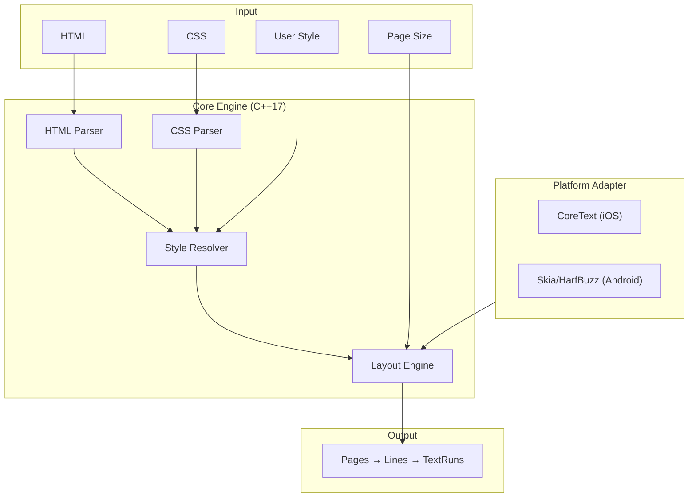
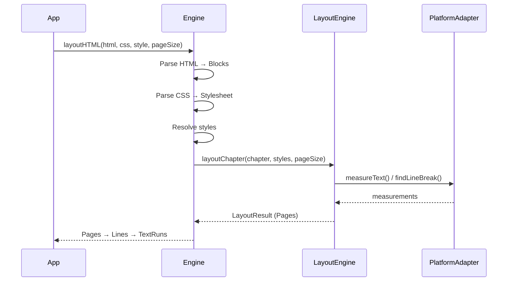

# Typesetting

A high-performance C++ typesetting engine with CSS styling support, designed for e-book rendering on iOS and Android.

## Features

- **HTML Parsing** - Parses structured HTML into block-level and inline elements
- **CSS Styling** - Full SE (Standard Ebooks) CSS support with selector matching and style resolution
- **Page Layout** - Precise text layout with multi-font inline rendering, justification, and hyphenation
- **Cross-Platform** - Platform-agnostic core with native bindings for iOS (CoreText) and Android (JNI)
- **Style Cascading** - Three-tier style priority: engine defaults → CSS rules → user preferences

## Architecture



## Project Structure

```
typesetting/
├── include/typesetting/   # Public headers
│   ├── engine.h           # Main entry point (Engine class)
│   ├── document.h         # HTML parsing (Block, InlineElement)
│   ├── css.h              # CSS parsing (CSSStylesheet, CSSRule)
│   ├── style.h            # Style types (Style, BlockComputedStyle)
│   ├── style_resolver.h   # CSS → computed style resolution
│   ├── layout.h           # Layout engine (LayoutEngine)
│   ├── page.h             # Output types (Page, Line, TextRun)
│   └── platform.h         # Platform abstraction (PlatformAdapter)
├── src/                   # Implementation
├── tests/                 # GoogleTest unit tests
├── bindings/
│   ├── swift/             # iOS binding (TypesettingBridge)
│   └── jni/               # Android binding (TypesettingJNI)
└── CMakeLists.txt
```

## Requirements

- CMake 3.20+
- C++17 compiler (Clang 10+ / GCC 9+ / MSVC 19.14+)
- macOS: CoreText, CoreFoundation, CoreGraphics frameworks

## Build

```bash
cmake -B build -DCMAKE_BUILD_TYPE=Release
cmake --build build
```

## Test

```bash
cmake -B build -DTYPESETTING_BUILD_TESTS=ON
cmake --build build
ctest --test-dir build --output-on-failure
```

## Usage



## License

MIT License. See [LICENSE](LICENSE) for details.
